# 									电商前台-vspace

## 一：平台前端框架介绍

#### (一)、Node.js

##### 1、node.js介绍

```
	简单的说 Node.js 就是运行在服务端的 JavaScript。Node.js 是一个基于 Chrome V8 引擎的 JavaScript 运行环境。Node.js 使用了一个事件驱动、非阻塞式 I/O 的模型,使其轻量又高效。速度非常快，性能非常好。Node.js 的包管理器 npm,是全球最大的开源库生态系统。官网地址：https://nodejs.org/zh-cn/
```

##### 2、node.js组成

```
1. 用户代码:JS代码，开发者编写的
2. 第三方库:大部分仍然是JS代码，由其他开发者编写
3. 本地模块代码:JS代码
4. V8引擎:c/c++代码，作用：把JS代码解释成为机器码,可以通过v8引擎的某种机制，扩展其功能,V8引擎的扩展和对扩展的编译，是通过一个工具：gyp工具。
```

##### 3、node.js应用场景

```
1、实时应用：如在线聊天，实时通知推送等等（如socket.io）
2、分布式应用：通过高效的并行I/O使用已有的数据
3、工具类应用：海量的工具，小到前端压缩部署（如grunt），大到桌面图形界面应用程序
4、游戏类应用：游戏领域对实时和并发有很高的要求（如网易的pomelo框架）
5、利用稳定接口提升Web渲染能力
6、前后端编程语言环境统一：前端开发人员可以非常快速地切入到服务器端的开发（如著名的纯Javascript全栈式MEAN架构）

```

##### 4、常用的NodeJS 框架

```
1、Express.JS
	Express.js 由核心 Node 项目团队的成员之一 TJ Holowaychuk 构建。大型社区支持此框架，因此具有不断更新和改革所有核心功能的优势。这是一个极简主义的框架，用于构建 mobile 应用程序和 API。Express 是一种小巧且灵活的 Node.JS Web 应用框架，可提供强大的功能集。强大的 API 允许用户通过配置路由在 前端 和数据库（充当 HTTP 服务器框架）之间发送或接收请求。

2、Koa
	Koa 由创建 Express.js 的同一团队开发，通常被称为下一代 NodeJS 框架。Koa 的独特之处在于它使用了一些非常酷的 ECMAScript （ES6）方法，这些方法甚至还没有出现在某些浏览器中。它使你无需 回调 即可工作，同时极大地扩展了错误 处理。下一代 NodeJS 的 Web 框架.KoaJS 支持 syn/await 关键字，能够有效地管理 代码。而且它的核心中没有打包捆绑任何中间件。这使得用 Koa 进行服务器开发变得更快、更有趣。KoaJS 有更多的自定义选项。它允许开发人员可以在其中仅添加他们需要的功能。

3、Socket.io
	它用于构建实时 Web 应用。这是一个 JavaScript 库，可在 Web 客户端和服务器之间进行双向数据通信。异步 数据 I/O、二进制流 和即时消息传递是此框架最重要的功能。最快、最可靠的实时引擎.

4、Hapi.JS
	Hapi 是一个强大且健壮的框架，用于开发API。完善的插件系统和各种关键功能（例如输入验证、基于配置的功能、实现缓存、错误处理、日志记录等）使 Hapi 成为最受欢迎的框架之一。它用于构建有用的应用，并通为 PayPal，Disney 等多个大型网站提供技术解决方案。Hapi 以最小的开销构建安全、强大、可扩展的开箱即用的功能.Hapi 的模式是配置驱动的，为控制 Web 服务器操作而构建的。它具有的独特功能是能够在特定的 IP 上创建服务器，并具有诸如 “onPreHandler” 之类的功能，我们可以其请求执行某些 拦截操作，然后对请求进行一些预处理。

5、Total.JS
	Total.js 是一种现代的模块化 NodeJS，支持 MVC 架构。Angular.js，Polymer，Backbone.js，Bootstrap 和其他 客户端 框架与此框架完全兼容。该框架是完全可扩展和异步的。它不需要任何工具，例如 Grunt 进行压缩，因此易于使用。它还内置了 NoSql，并支持数组和其他prototype 。是用于快速和强大的网站、REST服务、实时应用的最佳选择Total.js 有一些非常漂亮的版本，例如 Total.js Eshop，其中包含针对移动设备进行了优化的用户界面，并且所有 premium 成员均可下载。Eshop 是最好的Node.js 电子商务 系统之一。这是因为其独特的内容 管理系统（* CMS*）。

6、Sail.JS
	开发人员中非常流行通过这个MVC 框架在 NodeJS 开发聊天应用、仪表盘和多人游戏，该框架得到了广泛的关注。它以构建数据驱动的 API 闻名。它使用水线进行对象相关的映射和 db 解决方案。该框架使用 Express.js 处理 HTTP 请求，并基于 Node.js 构建。它与 Grunt 模块兼容，包括 LESS ，SASS ，Stylus，CoffeeScript，Jade ，Dust，使其成为基于浏览器应用的理想选择。Sail 与多个前端平台高度兼容。开发人员在使用此框架时有足够的自由进行开发。

7、Derby
	这是一个 MVC 框架，用于创建实时移动和 Web 应用。Derby 的 Racer 是一种用于 Node.js 的实时数据同步引擎，可在客户端和服务器之间进行多站点、实时并发和数据同步。Racer 通过ShareJS 来优化解决方案并允许实时编辑应用。Derby 是用于编写现代 Web 应用的全栈框架Derby 是一个基于 MVC 结构的开源框架，它是一个全栈 NodeJS Web 框架。Derby 被认为是开发实时集成应用程序的理想选择。使用 DerbyJS，开发人员可以轻松添加 定制的 代码，并构建实时有效的定制网站。

8、Meteor.JS
	Meteor.JS 是最常用的 NodeJS 框架之一。如果我们不提及 MeteorJS 框架，那么这个列表是不完整的。它是 NodeJS 的全栈框架，允用户构建实时应用程序。它用于创建基于移动和基于 Web 的 javascript 应用。在庞大的开发人员、教程、自定义程序包和文档社区的支持下，该框架可以仅用 Javascript 就能够创建出色的 Web 和移动应用。

9、Loopback
	Loopback 是高度可扩展的 API 框架，允许用户创建可以与任何类型的 Web 客户端一起使用的 API ，并且可以轻松地桥接到后端的源。由于 Loopback 是一个开放源代码框架，用户可以以最少的编码知识或根本不需要编码就可以创建动态的 REST API。用于构建API和微服务的高度可扩展的 NodeJS 框架用于构建API和微服务的高度可扩展的 NodeJS 框架此外，它还提供了模型关系支持、第三方登录和存储服务、API扩展功能，更好的用户管理策略。

10、NestJS
	NestJs 是用 Node.js 构建的框架，用于构建高效、可扩展的 Node.js 服务器端应用。Nest 使用渐进式 JavaScript，并使用 TypeScript 编写。使用 TypeScript 构建意味着 Nest 具有强大的类型功能，并且结合了OOP（面向对象编程），FP（函数式编程）和FRP（函数式响应编程）的元素。NestJS 框架-一种渐进式的 NodeJS 框架，用于构建高效、可靠和可扩展的服务器端应用程序
```

#### (二)、vue.js(2.0)

##### 1、vue.js(2.0)介绍

```
	Vue.js（读音 /vjuː/, 类似于 view） 是一套构建用户界面的渐进式框架，创作者是尤雨溪。与其他重量级框架不同的是，Vue 采用自底向上增量开发的设计。Vue 的核心库只关注视图层，并且非常容易学习，非常容易与其它库或已有项目整合。另一方面，Vue 完全有能力驱动采用单文件组件和 Vue 生态系统支持的库开发的复杂单页应用。
	Vue.js主要优点：
	1、响应的数据绑定，每当修改数据，DOM便相应的更新。这样我们应用中的逻辑就几乎都是直接修改数据，不必与DOM更新搅在一起，这让我们的代码更容易撰写、理解与维护。
	2、组件系统让我们可以用 独立可复用的小组件来构建大型应用。
	3、特性：简洁（不需要像angualr那样建议服务、Controller、过滤器）、数据驱动(以观测者来实现的单项数据流)、组件化、轻量快速（压缩后15K，相比angualr差了15倍）、模块友好。
	4、vue和react虚拟DOM的Diff算法的复杂度从O(n^3)降到了O(n)。
	5、官网地址：https://v2.cn.vuejs.org/v2/guide/
```

##### 2、虚拟DOM(Virtual DOM)

```
1、Virtual DOM 只是js模拟的DOM结构。 虚拟DOM是HTML DOM的抽象 。虚拟DOM是由js实现的避免DOM树频繁更新，通过js的对象模拟DOM中的节点，然后通过特定的render方法将它渲染成真实的节点，数据更新时，渲染得到新的 Virtual DOM，与上一次得到的 Virtual DOM 进行 diff，得到所有需要在 DOM 上进行的变更，然后在 patch 过程中应用到 DOM 上实现UI的同步更新。

2、起源：虚拟dom最先是由facebook团队提出的，最先运用在react中，之后在vue2.0版本中引入了虚拟DOM的概念

3、虚拟DOM与真实DOM的区别：
	(1)、虚拟DOM不会进行排版与重绘操作。
	(2)、虚拟DOM进行频繁修改，然后一次性比较并修改真实DOM中需要改的部分（注意！），最后并在真实DOM中进行排版与重绘，减少过多DOM节点排版与重绘损耗。
	(3)、真实DOM频繁排版与重绘的效率是相当低的。
	(4)、虚拟DOM有效降低大面积（真实DOM节点）的重绘与排版，因为最终与真实DOM比较差异，可以只渲染局部。

```

##### 3、diff算法

```
	在进行节点比较时，是通过patch这个方法实现，其中如果不是真实元素并且用sameVnode看两个是否是同一个元素，如果是然后会调用patchVnode进行比较，比较的是虚拟节点不是真实节点，如果不值得去比较则用 Vnode 替换 oldVnode。patchVnode会比较这两个节点，判断 Vnode 和 oldVnode 是否指向同一个对象，如果是，那么直接 return，复用老的真是元素。如果不是会用新的子节点和旧的字节做比较。如果他们都有文本节点并且不相等，那么将el的文本节点设置为Vnode的文本节点；如果两个都有子节点的情况下会调用updateChildren方法比较他们的子节点；只有新的节点有子节点而旧节点没有子节点，就会把新增的子节点插入到旧的dom中；如果当前新的节点中没有子节点，旧的中有子节点，然后就会把旧的节点删除掉；
```

#### (三)、element ui

```
	Element UI是一套为开发者、设计师和产品经理准备的基于 Vue 2.0 的桌面端组件库，了解设计指南,帮助产品设计人员搭建逻辑清晰、结构合理且高效易用的产品。提供了配套设计资源，帮助你的网站快速成型。由饿了么公司前端团队开源。官网地：https://element.eleme.cn/#/zh-CN/component/installation
	设计原则：
	1.一致性 Consistency,与现实生活一致：与现实生活的流程、逻辑保持一致，遵循用户习惯的语言和概念；在界面中一致：所有的元素和结构需保持一致，比如：设计样式、图标和文本、元素的位置等。
	2.反馈 Feedback,控制反馈：通过界面样式和交互动效让用户可以清晰的感知自己的操作；页面反馈：操作后，通过页面元素的变化清晰地展现当前状态。
	3.效率 Efficiency,简化流程：设计简洁直观的操作流程；清晰明确：语言表达清晰且表意明确，让用户快速理解进而作出决策；帮助用户识别：界面简单直白，让用户快速识别而非回忆，减少用户记忆负担。
	4.可控 Controllability,用户决策：根据场景可给予用户操作建议或安全提示，但不能代替用户进行决策；结果可控：用户可以自由的进行操作，包括撤销、回退和终止当前操作等。
```

## 二： 开发环境搭建

#### (一)、全局安装Node.js

​		Node.js 安装包及源码下载地址为：https://nodejs.org/zh-cn/download/。此处使用的安装包(.msi)。

##### 1、下载.msi)包，根据自己电脑选择32位还是64位

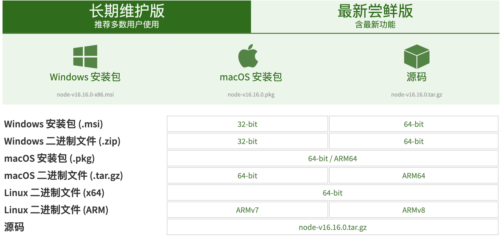

##### 2、安装下载包.msi

步骤 1 : 双击下载后的安装包，如下所示：


步骤 2 : 点击以上的Run(运行)，将出现如下界面：


步骤 3 : 勾选接受协议选项，点击 next（下一步） 按钮 :


步骤 4 : Node.js默认安装目录为 "C:\Program Files\nodejs\" , 你可以修改目录，并点击 next（下一步）：


步骤 5 : 点击树形图标来选择你需要的安装模式 , 然后点击下一步 next（下一步）:


步骤 6 :点击 Install（安装） 开始安装Node.js。你也可以点击 Back（返回）来修改先前的配置。 然后并点击 next（下一步）：


安装过程：


点击 Finish（完成）按钮退出安装向导。


##### 3、检查安装node结果

​	安装好之后检查node安装情况：点击开始=》运行=》输入"cmd"打开电脑命令行窗口输入 node -v 回车即可看到当前安装node 版本，表示安装成功。如下图所示


#### (二)、安装vue-cli脚手架

​	输入命令：npm install --global vue-cli 回车；验证是否安装成功，在命令输入vue，出来vue的信息，及说明安装成功；

#### (三)、初始化一个vue项目

​	新建个workspace文件夹(存放项目地方)，通过命令行窗口进入到workspace根目录下；输入：vue init webpack vspace

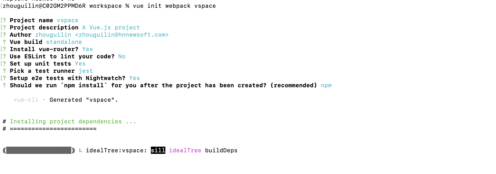

​	出现这样的提示，初始化成功

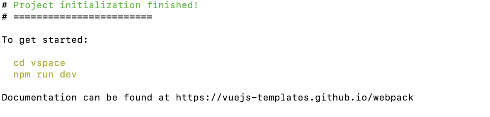

​	根据提示输入运行项目

```js
$ cd vspace
$ npm install
$ npm run dev
```

​	显示如下图，表示项目启动成功：

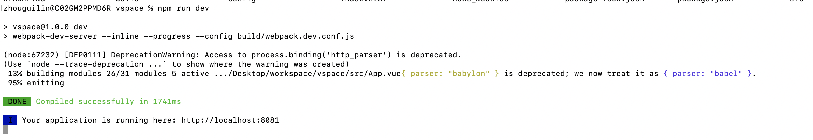

​	在浏览器中输入 http://localhost:8081 回车：

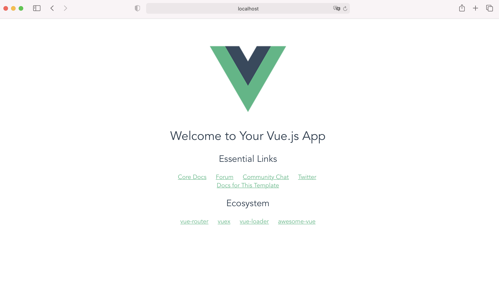

#### (四)、安装 elementUI

​	在vspace根目录下输入： npm i element-ui -S；出现如下图表示安装完成


​	在main.js中加入以下代码全局引入elementUI

```js
import Vue from 'vue';
import ElementUI from 'element-ui';
import 'element-ui/lib/theme-chalk/index.css';
import App from './App.vue';

Vue.use(ElementUI);

new Vue({
  el: '#app',
  render: h => h(App)
});
```

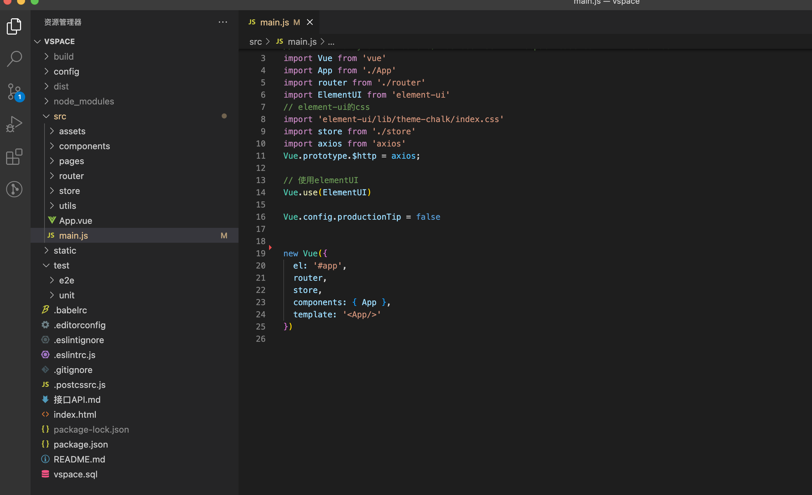

## 三：vspace页面梳理

#### (一)、登陆模块

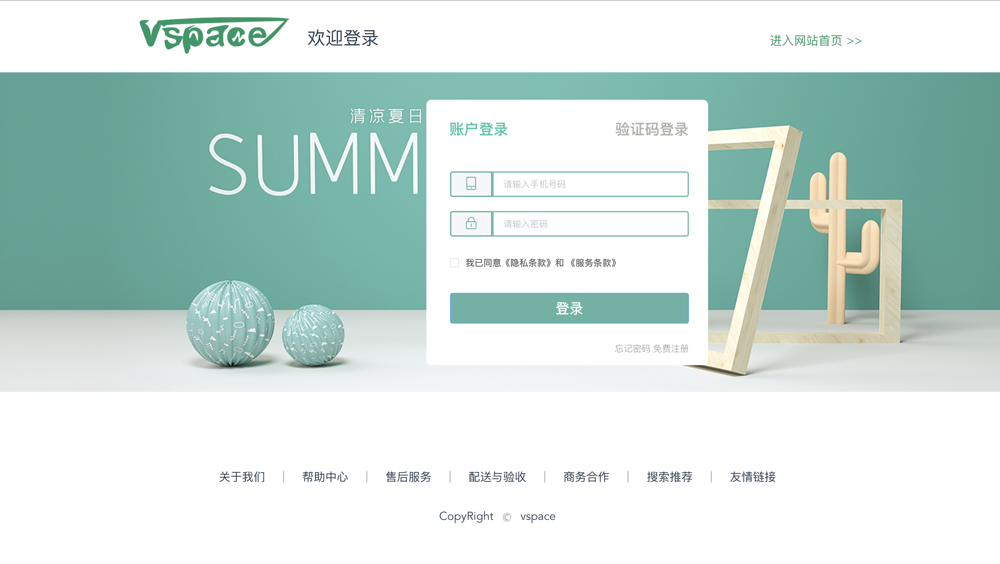

#### (二)、注册页面

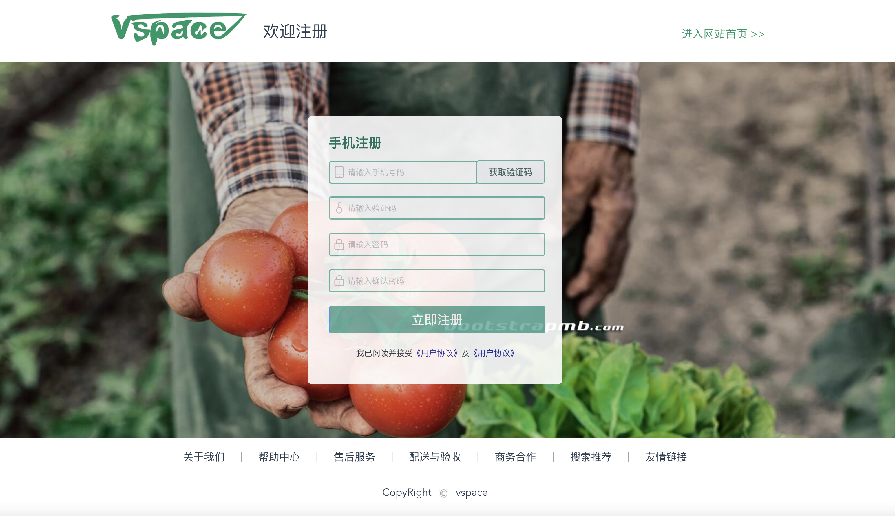

#### (三)、公共header菜单


#### (四)、首页

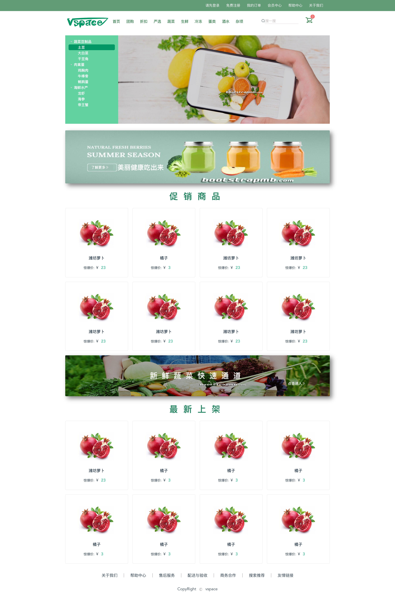

#### (五)、会员中心--基本信息

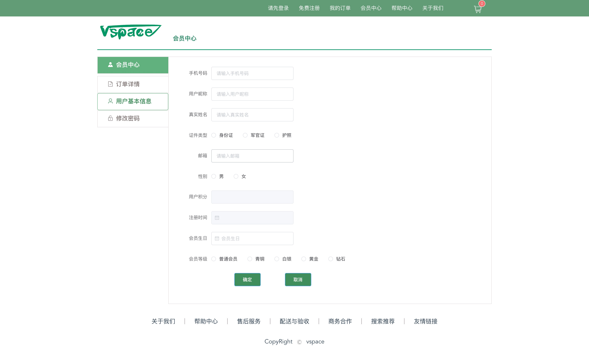

#### (六)、会员中心--修改密码

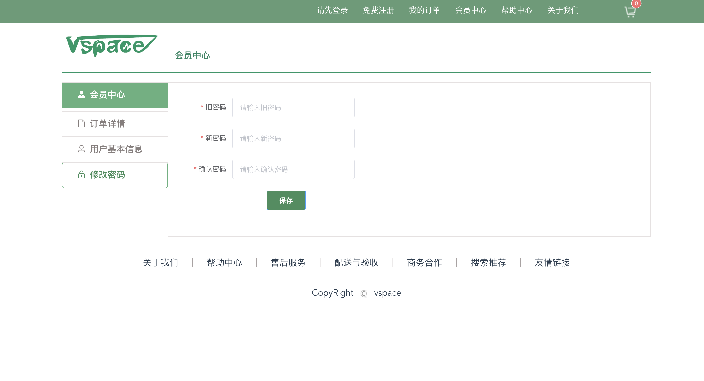

#### (七)、会员中心--订单详情

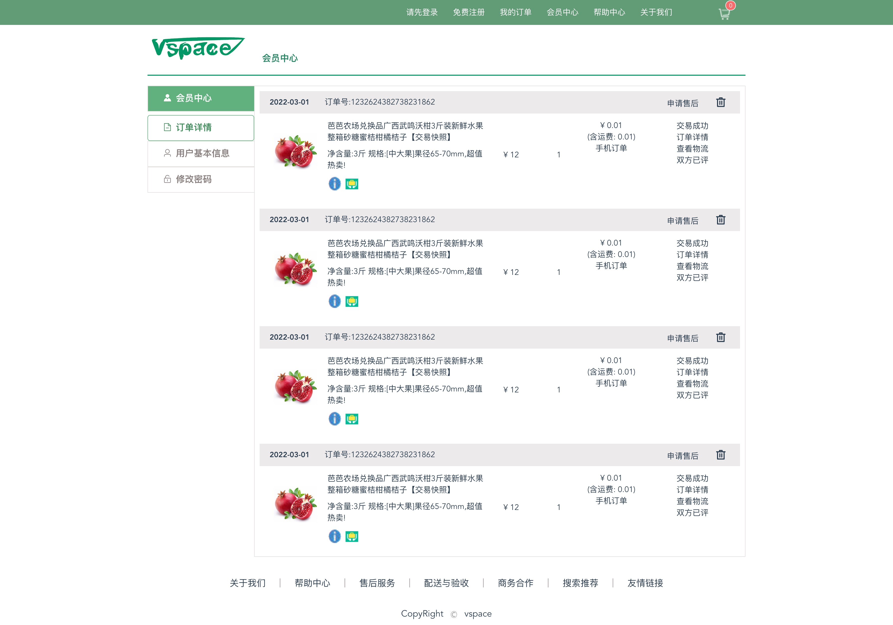

#### (八)、商品分类页面

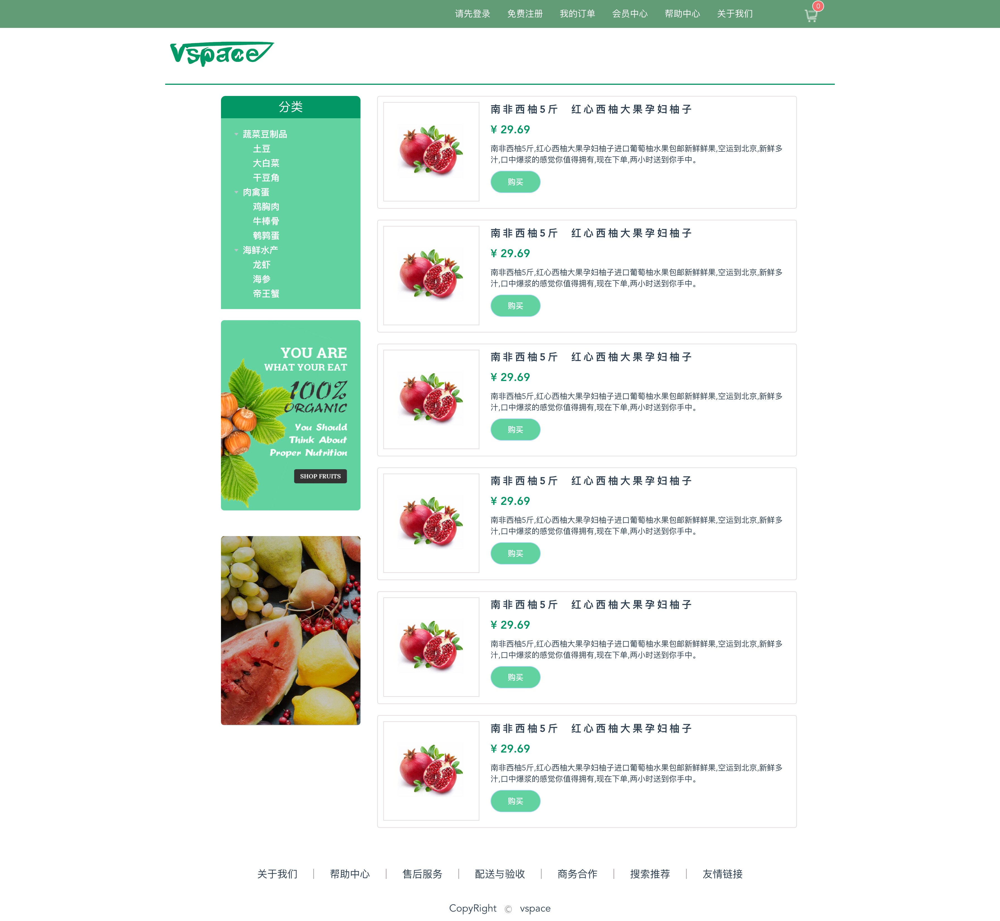

#### (九)、购买商品页

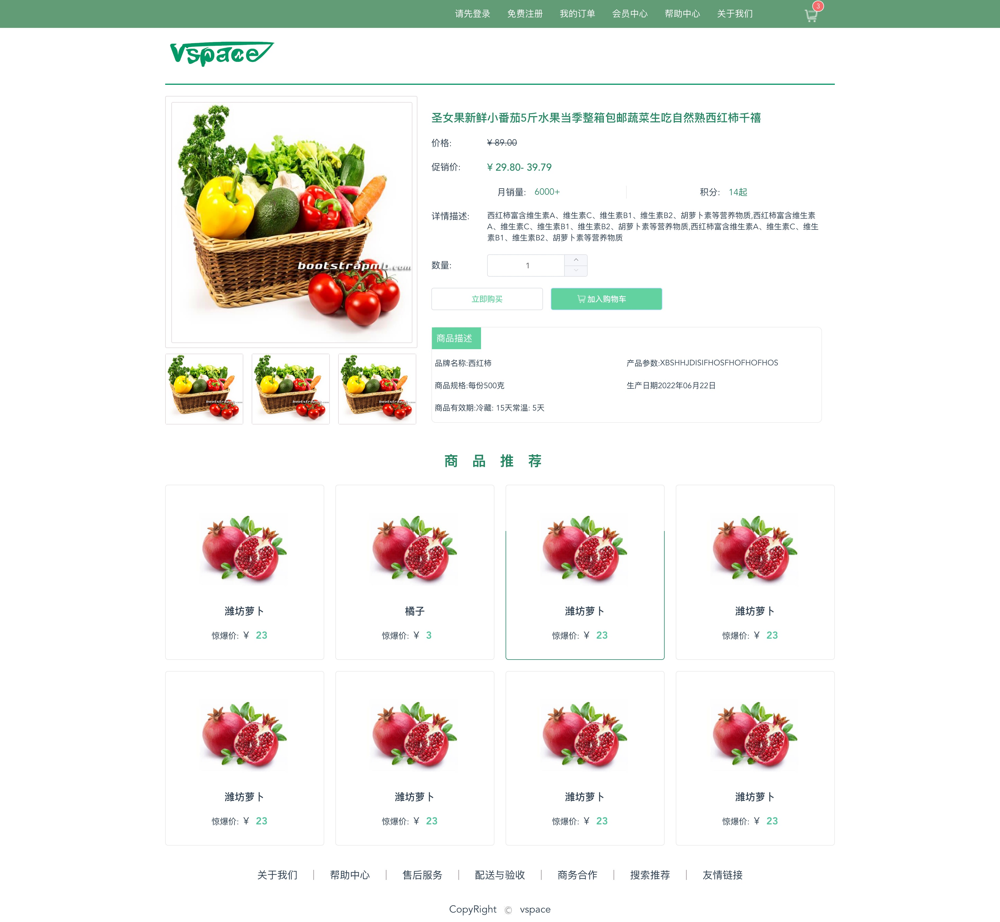

#### (十)、、购物车页面

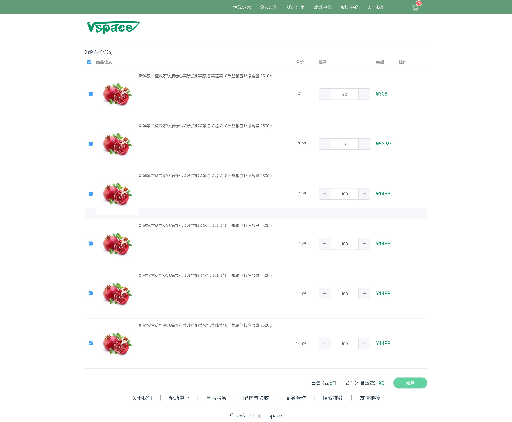

#### (十一)、结算页面

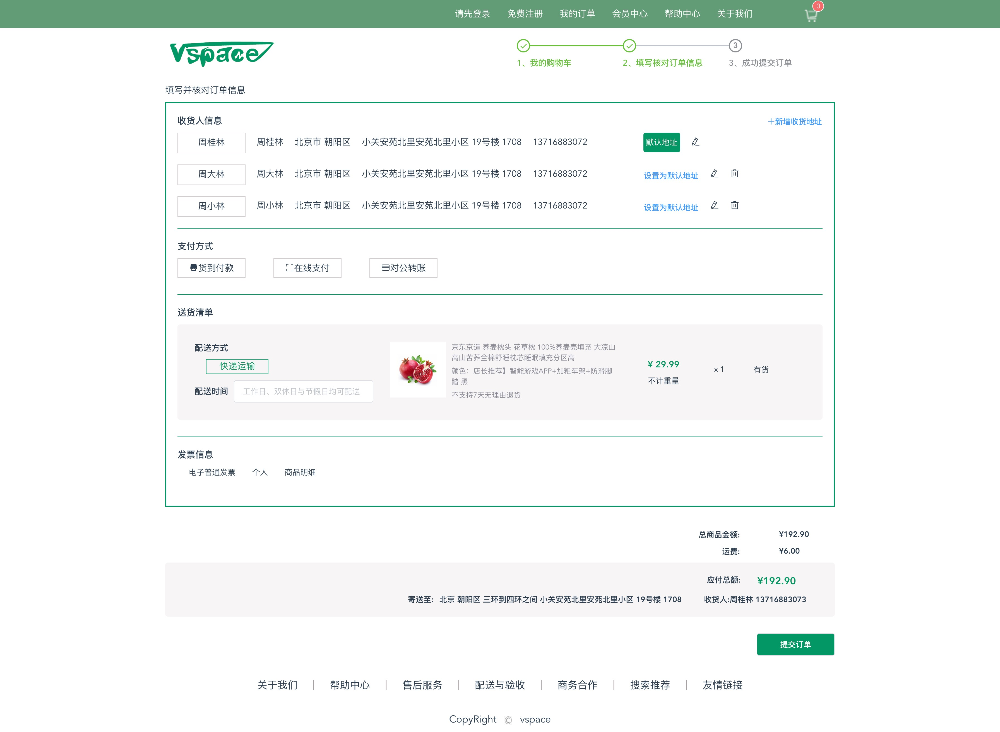

#### (十二)、收货地址编辑页

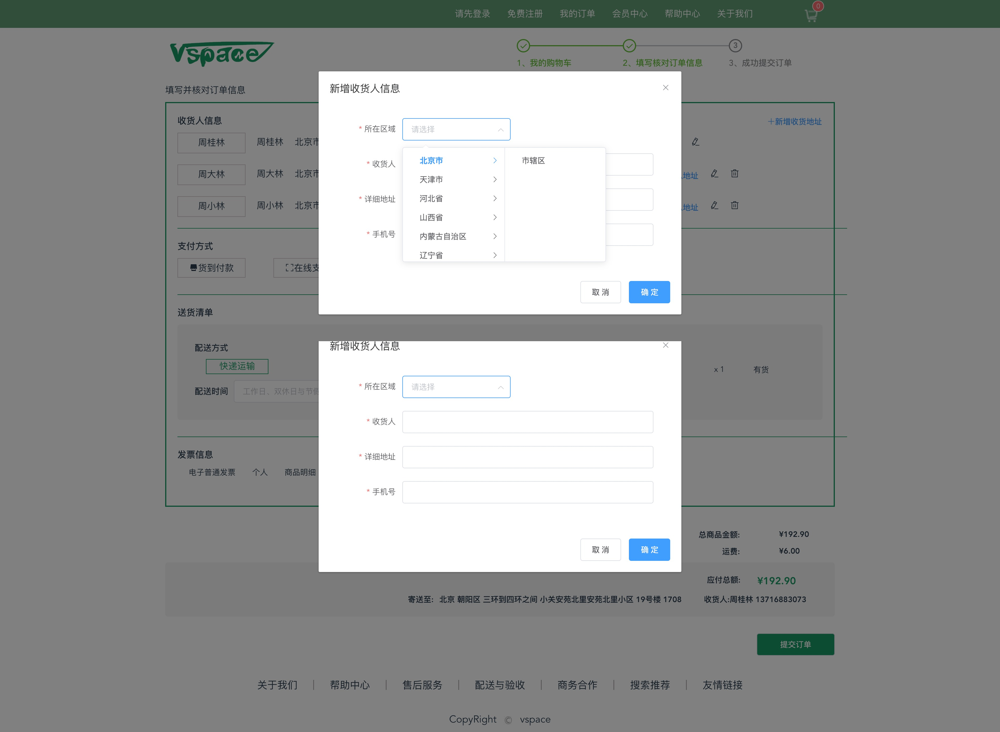

#### (十三)、支付页面

#### (十四)、支付成功页面

#### (十五)、支付失败

## 四：vspace项目目录结构

#### (一)、工程目录结构详解

```javascript
     |-- build 构建脚本目录
          |--build.js ---- 生产环境构建脚本
          |--build-server.js ---- 运行本地构建服务器，可以访问构建后的页面
          |--dev-client.js ---- 开发服务器热重载脚本，主要用来实现开发阶段的页面自动刷新
          |--dev-server.js ---- 运行本地开发服务器
          |--check-version.js ---- 检查npm、node.js版本
          |--utils.js ---- 构建相关工具方法
          |--vue-loader.conf.js ---- 配置css加载器以及编译css之后自动添加前缀
          |--webpack.base.conf.js ---- webpack基本配置
          |--webpack.dev.conf.js ----- webpack开发环境配置
          |--webpack.prod.conf.js ---- webpack生产环境配置
      |-- config：项目配置
          |-- dev.env.js ---- 开发环境变量
          |-- index.js ---- 项目配置文件
          |-- prod.env.js ---- 生产环境变量
          |-- test.env.js ---- 测试环境变量
      |-- node_modules：npm加载项目的依赖模块
      |-- package.json
      |-- src (源码目录,名称不可修改)
          |-- rassets：资源文件，比如存放 css，图片等资源。
          |-- component：组件文件夹，用来存放 vue 的公共组件（注册于全局，在整个项目中通过关键词便可直接输出）
          |-- router:用来存放index.js，这个 js 用来配置路由
          |-- store: 状态管理 vuex
          |-- utils：用来存放工具类 js，将 js 代码封装好放入这个文件夹可以全局调用（比如常见的​ api.js​，​http.js​ 是对 http 方法和 api 方法的封装）。
          |-- views：用来放主体页面，虽然和组件文件夹都是 vue 文件，但 views 下的 vue 文件是可以用来充当路由 view 的。
          |-- main.js:是项目的入口文件，作用是初始化 vue 实例，并引入所需要的插件。
          |-- app.vue:是项目的主组件，所有页面都是在该组件下进行切换的。
      |-- static 静态资源目录。不会被webpack构建
      |-- package.json：npm包配置文件，定义项目的npm脚本、依赖包等信息
      |-- README.md：项目的说明文档，markdown格式   
      |-- .gitignore   

```

#### (二)、vue-cli初始化构建

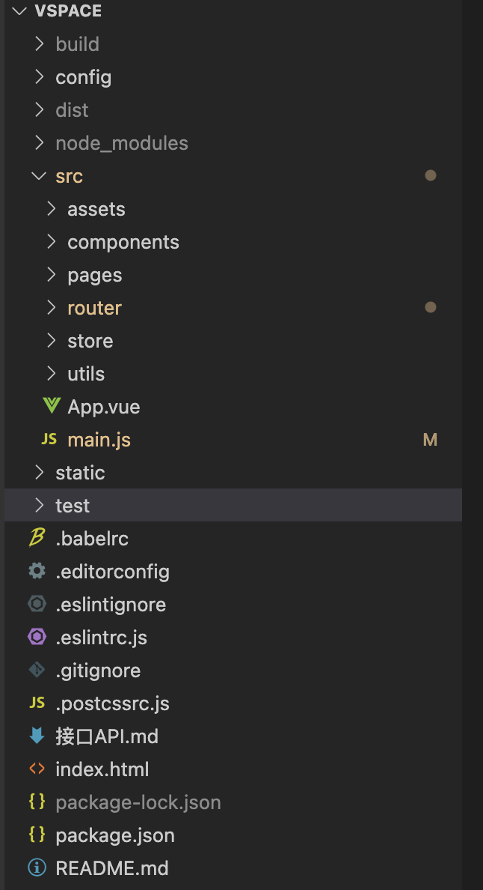

## 五、Vue-Router

#### (一)、认识vue-router

​		vue-router是Vue.js官方的路由插件，它和vue.js是[深度](https://so.csdn.net/so/search?q=深度&spm=1001.2101.3001.7020)集成的，适合用于构建单页面应用。我们可以访问其官方网站对其进行学习：https://router.vuejs.org/zh/introduction.html

​		vue-router是基于路由和组件的：

- 路由用户设定访问路径的，将路径和组件映射起来。

- 在vue-router的单页面应用中，页面的路径的改变就是组件的切换

- 安装，进入到项目根目录下：

  ```
  npm install vue-router --save
  ```

#### (二)、路由的默认路径

##### 1、默认路径

​	默认路径情况下，进入网站的首页，我们希望渲染首页的内容。但是我们的实现中，默认没有显示首页组件，必须让用户点击才可以。如何可以让路径默认跳转到首页，并且渲染首页组件呢？我们需要多配置一个映射就可以了。

```javascript
{
  path: '/',
  redirect: '/home'
},
```

##### 2、配置解析：

- 我们在routes中又配置一个映射
- path配置的是根路径：/
- redirect是重定向，也就是我们将根路径重定向到/home的路径下，这样就可以得到我们想要的结果了。

#### (三)、History 模式 和 hash 模式

```javascript
//配置方式
const router = new VueRouter({
  mode: 'history'
})
```

##### 1、History 模式

​		history接口是HTML5新增的, history 它有五种模式改变URL而不刷新页面。

##### 2、hash模式

​		hash本质上是改变window.location的href属性，你只能改变#后面的url片段。 我们可以通过直接赋值location.hash来改变href, 但是页面不发生刷新

#### (四)、router-link

​	1、to：用于指定跳转的路径
​	2、tag：tag可以指定<router-link>之后渲染成什么组件，比如我们下面的代码会被渲染成一个<li>元素，而不是<a> 。 如：

```vue
<router-link to='/home' tag='li'>
```

​	3、replace：replace不会留下history记录，所以指定replace的情况下，后退键返回不能返回到上一个页面中
​	4、active-class：当<router-link>对应的路由匹配成功时，会自动给当前元素设置一个router-link-active的class，设置active-class可以修改默认的名称

#### (五)、路由传参

##### 1、params 刷新页面参数会丢失

```javascript
   // 定义路由
{path:user/:name''}  
# 方式一
	// 传参数
<router-like to="user/name" /> 
	// 取参数
this.$route.params.name
# 方式二
 // 传参数
this.$router.push({ name: 'news', params: { userId: 123 }})
 // 取参数
this.$route.params.userId
```

##### 2、query 刷新页面参数不丢失

```javascript
// 传参数
this.$router.push({ path: '/news', query: { userId: 123 }});       
// 取参数
this.$route.query.userId
```

#### (六)、路由守卫（其实就是监听路由状态）

##### 1、全局路由守卫

​	1、beforeEach(to, from, next) 全局前置守卫，路由跳转前触发

```javascript
const router = new VueRouter({ ... })

router.beforeEach((to, from, next) => {
  // ...
})
# 在路由跳转前触发，在实际项目中应用最多，主要是登陆验证和跳转权限判断
```

​	2、beforeResolve(to, from, next) 全局解析守卫 在所有组件内守卫和异步路由组件被解析之后触发

```javascript
router.beforeResolve((to, from, next) => {
  // ...
})
#类似于路由前置守卫 beforeEach(to, from, next)，也是路由跳转前触发，但它是同时在所有组件内守卫和异步路由组件被解析之后触发的
调用时机：在 beforeEach(to, from, next)和组件内beforeRouteEnter(to, from, next)之后，afterEach(to, from)之前调用
```

​	3、afterEach(to, from) 全局后置守卫，路由跳转完成后触发

```javascript
router.afterEach((to, from) => {
  // ...
})
#于路由前置守卫 beforeEach(to, from, next)相对，路由跳转后触发，但它是同时在所有组件内守卫和异步路由组件被解析之后触发的;
#调用时机：在 beforeEach(to, from, next)和组件内beforeResolve (to, from, next)之后， beforeRouteEnter(to, from)之前调用
```

##### 2、路由独享守卫

​	1、beforeEnter(to,from,next) 路由对象单个路由配置 ，单个路由进入前触发

```javascript
const router = new VueRouter({
  routes: [
    {
      path: '/foo',
      component: Foo,
      beforeEnter: (to, from, next) => {
        // ...
      }
    }
  ]
})
#于路由前置守卫 beforeEach(to, from, next)相同，但在beforeEach(to, from, next)后触发
```

##### 3、组件路由守卫

​	1、beforeRouteEnter(to,from,next) 在组件生命周期beforeCreate阶段触发

```javascript
const Foo = {
  template: `...`,
  beforeRouteEnter(to, from, next) {
    // 不能获取组件实例 
    // 因为当守卫执行前，组件实例还没被创建
  }
#因为该守卫在组件创建之前阶段触发，那个时候组件还没有创建成功，所以这个守卫内不能使用this获取组件实例;
#调用时机：在全局守卫beforeEach(to, from, next)和独享守卫beforeEnter(to, from, next)之后，全局beforeResolve(to, from, next)和全局afterEach(to, from)之前调用
```

​	2、beforeRouteUpdadte(to,from,next) 当前路由改变时触发

```javascript
  beforeRouteUpdate(to, from, next) {
    // 在当前路由改变，但是该组件被复用时调用
    // 举例来说，对于一个带有动态参数的路径 /foo/:id，在 /foo/1 和 /foo/2 之间跳转的时候，
    // 由于会渲染同样的 Foo 组件，因此组件实例会被复用。而这个钩子就会在这个情况下被调用。
    // 可以访问组件实例 
  },
#调用时机：在当前路由复用时
```

​	3、beforeRouteLeave(to,from,next) 导航离开该组件的对应路由时触发

```javascript
  beforeRouteLeave(to, from, next) {
    // 导航离开该组件的对应路由时调用
    // 可以访问组件实例
  }
}
#通常用来禁止用户在还未保存修改前突然离开; 
#调用时机：导航离开该组件的对应路由时调用;
```

#### (七)、常用方法

```vue
router.push(url) 导航到新url，向 history栈添加一条新访问记录，等同于window.history.pushState

router.replace(url) 导航到新url，替换 history 栈中当前记录，等同于window.history.replaceState

router.go(n) 在 history 记录中向前或者后退多少步，类似 window.history.go(n)

router.go(1) 在浏览器记录中前进一步，等同于 history.forward()

router.go(-1) 后退一步记录，等同于 history.back()

router.go(0) 刷新当前页面

router.back() 导航回退一步，类似于router.go(-1)

router. forward() 导航前进一步，但是不刷新前进页的表单，类似于router.go(1)
```

## 六、路由配置

​		vspace初始化构建时候已经内置了vue-router，此处我们就不需要手动安装vue-router

```javascript
npm install vue-router --save
```

#### (一)、全局注入router

​	找到src/main.js 路径下的main.js

```javascript
import router from './router'
new Vue({
  el: '#app',
  router,
  components: { App },
  template: '<App/>'
})
```

#### (二)、引入具体的page

##### 	1、建立好所需要跳转的page页面：

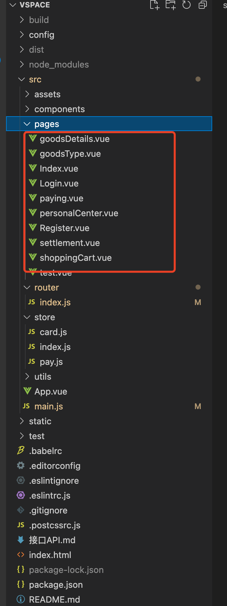

##### 2、找到router.js，引入涉及到菜单跳转的页面地址

```javascript
import Vue from 'vue'

import Index from '@/pages/Index'
import Login from '@/pages/Login' 
import Register from '@/pages/register'
import PersonalCenter from '@/pages/personalCenter'
import GoodsType from '@/pages/goodsType'
import GoodsDetails from '@/pages/goodsDetails'
import ShoppingCart from '@/pages/shoppingCart'
import Settlement from '@/pages/settlement'
import Paying from '@/pages/paying'
```

#### (三)、路由配置

##### 1、创建router实例

```javascript
import Router from 'vue-router'
Vue.use(Router)
```

##### 2、挂载到Vue实例中

```javascript
new Vue({
  el: '#app',
  router,
  store,
  components: { App },
  template: '<App/>'
})
```

##### 3、创建路由组件

例如创建组件src/components/Footer.vue、src/components/Header.vue

```javascript
import Vue from 'vue'
import Router from 'vue-router'
import Index from '@/pages/Index'
import Login from '@/pages/Login'
import Register from '@/pages/register'
import PersonalCenter from '@/pages/personalCenter'
import GoodsType from '@/pages/goodsType'
import GoodsDetails from '@/pages/goodsDetails'
import ShoppingCart from '@/pages/shoppingCart'
import Settlement from '@/pages/settlement'
import Paying from '@/pages/paying'
```

##### 4、配置路由映射：组件和路径映射关系

```javascript
export default new Router({
  routes: [
    {
      path: '/',
      name: 'Index',
      component: Index
    },
    {
      path: '/login',
      name: 'login',
      component: Login
    },
    {
      path: '/register',
      name: 'register',
      component: Register
    },
    {
      path: '/personalCenter',
      name: 'personalCenter',
      component: PersonalCenter
    },
    {
      path: '/goodsType',
      name: 'goodsType',
      component: GoodsType
    },
    {
      path: '/goodsDetails',
      name: 'goodsDetails',
      component: GoodsDetails
    },
    {
      path: '/shoppingCart',
      name: 'shoppingCart',
      component: ShoppingCart
    },
    {
      path: '/settlement',
      name: 'settlement',
      component: Settlement
    },
    {
      path: '/paying',
      name: 'paying',
      component: Paying
    },
  ]
})
```


## 七：页面布局设计

#### (一)、整体布局

##### 1、需求背景：

​	1、页面适配显示器屏幕的大小

​	2、不考虑移动端

​	3、中间定宽，两边留白适配，防止浏览器窗口放大缩小内容展示混乱

​	4、高度自适应

##### 2、效果如图


##### 3、代码实现

​	给父容器添加css代码

```css
.pageContent {
  width: 1140px;
  margin: auto;
  padding: 20px 30px;
  height: 72px;
}
```

或者

```css
.pesponCenter {
  padding: 20px 0px;
  width: 1200px;
  margin: auto;
  display: flex;
}
```


#### (二)、字体规范

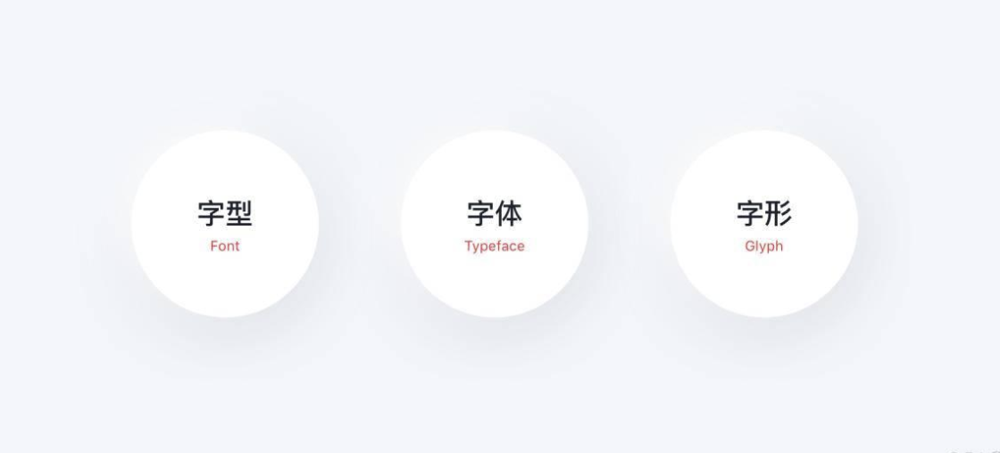

vspace字体全部为默认 微软雅黑；大小可根据自己是觉察自行调整；主流颜色为#009866，color值也可以根据自行调整深浅；

## 八、Axios

#### (一)、Axios是什么？

​	Axios是一个基于promise的HTTP库，主要用于浏览器和node.js。

​	官网地址：http://www.axios-js.com/zh-cn/docs/

#### (二)、Axios有哪些特性？

​	1、支持Promise API

​	2、拦截请求和响应请求

​	3、转换请求数据和响应数据（请求是可以加密，在返回时也可进行解密）

​	4、取消请求

​	5、自动转换JSON数据（无需手动操作）

​	6、客户端支持防御XSRF攻击

#### (三)、Axios常用的请求方法？

##### 1、get：获取数据

```javascript
// 写法一
axios.get("https://api.thecatapi.com/v1/images/search", {
    params: {
      limit: 1,
      page: 10,
      order: "Desc",
    },
  })
  .then((res) => {
    console.log(res);
}); 

// 写法二
axios({
      method: "get",
      url: `https://api.thecatapi.com/v1/images/search?limit=${1}&page=${10}&order=${"Desc"}`,
    }).then((res) => {
      console.log(res);
});
```

##### 2、post ：提交数据，表单提交或文件上传等。

post的两种请求格式：

**form-data （常用于文件/图片上传）：**content-type: multipart/form-data; boundary=----WebKitFormBoundaryK0A5EtRCDRaTJb7x boundary(后端解码内容)

**application/json 常用格式，如data：**content-type: application/json; charset=utf-8

```javascript
// 请求方式一：application/json
// 写法一
let dataTest = {
  image_id: "asf2",
  sub_id: "my-user-1234",
  value: 1,
};
axios.post("https://api.thecatapi.com/v1/votes", dataTest).then((res) => {
  console.log(res);
}); // 请求方式二：form-data
// 写法二
let formData = new FormData();
formData.append("image_id", "asf2");
formData.append("sub_id", "my-user-1234");
formData.append("value", '1');
axios({
  method: "post",
  url: "https://api.thecatapi.com/v1/votes",
  data: formData,  // params 参数在请求体内
}).then((res) => {
  console.log(res);
});
```

##### 3、put ：更新数据（所有数据推送到后端）

put请求和post请求传参的方法是一样的，post和put通过报头向后端传参

```javascript
let dataTest = {
  image_id: "asf2",
  sub_id: "my-user-1234",
  value: 1,
};
axios.put("https://api.thecatapi.com/v1/votes", dataTest).then((res) => {
  console.log(res);
});
```

##### 4、patch ：更新数据（只将修改的数据推送到后端）

```javascript
let data = {
  id:12
}
axios.patch('https://api.thecatapi.com/v1/votes', {data}).then(
  (res) => {
    //执行成功后代码处理
  }
)
//写法二
axios({
  method: 'patch',//请求方法
  data: data,
  url: 'https://api.thecatapi.com/v1/votes',
}).then(res => {
  //执行成功后代码处理
})

```

##### 5、delete：删除数据

get和delete是通过params方式即为从url后面加后缀传参；post和delete在vue中需要使用qs序列化

```javascript
//普通方式传参
var param={id:1,name:'李建业'}
export function removeFile (parameter) {
  return axios({
    url: `/file/file/delete`,
    method: 'delete',
    data:parameter
  })
}

//参数为数组格式
//需要引入插件qs将数组进行转译
cnpm install --save qs
var param={fileList:['李建业']}
import qs from 'qs';
//删除附件
export function removeFile (parameter) {
  parameter.fileList=qs.stringify(parameter.fileList)
  return axios({
    url: `/file/file/delete`,
    method: 'delete',
    params:parameter
  })
}

```

#### (四)、Axios并发方法

并发请求：同时进行多个请求，并统一处理返回值。

```javascript
// axios.all() 是一个数组，存放axios请求，数组顺序即请求数据
// axios.spead() 是多个请求(axios.all())完成后,对它的返回数据进行分割处理
axios.all([
   axios.get(`https://api.thecatapi.com/v1/images/search?limit=${1}&page=${10}&order=${"Desc"}`),
   axios.get('https://dog.ceo/api/breeds/image/random') 
]).then(
  // 并发的then不能只写一个回调请求
  axios.spread((catApi,dogApi)=>{
    console.log(catApi,dogApi)
  })
)
```

#### (五)、Axios 实例及配置

Axios 实例

```javascript
let instance = axios.create({
  baseURL:'http://localhost:8080',
  timeout:1000
})

instance.get('https://dog.ceo/api/breeds/image/random').then(res=>{
  console.log(res)
})
```

Axios 实例相关配置

```javascript
.baseURL：请求的基础地址，请求接口时会拼接在baseURL后面
.timeout：请求的超时时长(毫秒)，如果请求的数据量比较大，会堵塞后端内容，然后超时释放超时内容。
.url：请求的路径
.method：请求的方法，get,post,pull,patch,delete
.headers：请求头，存放token。
.params：请求参数拼接在url上
.data：请求参数拼接在请求体内

let instance = axios.create({
  baseURL:'http://localhost:8080',
  timeout:1000,
  url:'',
  method:'get',
  headers:{
    token:''
  },
  params:{},
  data:{}
})
```

#### (六)、Axios请求多个域名接口

```javascript
// Axios请求多个域名接口：
let instance = axios.create({
  baseURL:'http://localhost:8080',
  timeout:1000,
})
let instance2 = axios.create({
  baseURL:'http://localhost:8081',
  timeout:3000,
})
// 请求不同的域名接口
instance.get('/').then(()=>{console.log})
instance2.get('/',{timeout:5000}).then(()=>{console.log})
```

#### (七)、Axios拦截器

- 拦截器：在请求或响应被处理前拦截它们

- 请求拦截器：在前端发起请求前处理

- 响应拦截器：在后端响应请求后处理

- 取消拦截器（不常用）

  ```javascript
  // 请求拦截器：在前端发起请求前处理
  axios.interceptors.request.use(
    (config) => {
      // 发送请求前做些什么，如判断是否有token
      return config;
    },
    (Error) => {
      // 请求错误时返回
      return Promise.reject(Error);
    }
  );
  ```

  ```javascript
  // 响应拦截器：在后端响应请求后处理
  axios.interceptors.response.use(
    (res) => {
      // 请求成功后做些什么，如判断后端返回的code状态码
      return res;
    },
    (Error) => {
      // 响应错误做些什么
      return Promise.reject(Error);
    }
  );
  instance.get("/").then((res) => {
    console.log(res);
  }); // then请求失败
  instance2.get("/", { timeout: 5000 }).catch((Error) => {
    console.log(Error);
  }); // catch请求失败
  ```

  ```javascript
  // 取消拦截器（不常用）
  let interceptors = axios.interceptors.response.use((config) => {
    // 请求之前可以在headers中新增auth参数
    config.headers = {
      auth: true,
    };
    return config;
  });
  // 取消headers中的auth
  axios.interceptors.request.eject(interceptors);
  ```

## 九、Http.js封装

#### 	(一)、reques请求报文 请求包含四部分

1、请求行：动词（GET/POST） 路径(带查询字符串) 协议/版本号（HTTP/1.1这样的）

2、请求头： 一堆 key: value（value前有空格 ）

3、回车 作用只有一个，分离第二部分和第四部分

4、请求体：Body 随便什么内容都可以，但是内容的格式需要在第二部分当中的Contet-type 当中说明


#### (二)、response 响应报文请求包含四部分

1、响应行：协议/版本号（HTTP/1.1这样的） 状态码 状态信息

2、响应头：一堆 key: value（value前有空格 ）

3、回车 作用只有一个，分离第二部分和第四部分

4、响应体：Body 随便什么内容都可以，但是内容的格式需要在第二部分当中的Contet-type 当中说明

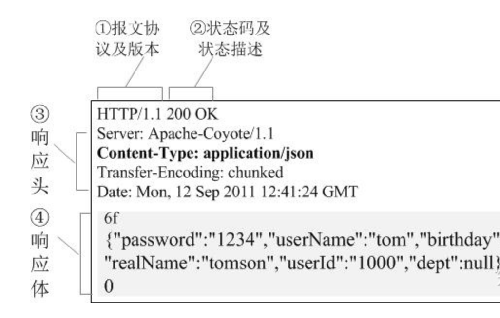

#### (三)、Vspcae封装http

##### 1、安装axios

```javascript
 npm install axios -g
```

##### 2、main.js注册axios

​	找到main.js 全局引用axios

```javascript
import axios from 'axios'
Vue.prototype.$http = axios;
```

##### 3、新建 http.js 

​	项目目录找到 src =>utils 文件夹新建http.js

```javascript
import axios from 'axios';
// import { Message } from 'element-ui';
// axios.defaults.timeout = 5000;
// axios.defaults.baseURL ='';
 
//http request 拦截器
axios.interceptors.request.use(
  config => {
    // const token = getCookie('名称');注意使用的时候需要引入cookie方法，推荐js-cookie
    config.data = JSON.stringify(config.data);
    config.headers = {
      'Content-Type':'application/x-www-form-urlencoded',
    }
    // if(token){
    //   config.params = {'token':token}
    // }
    return config;
  },
  error => {
    return Promise.reject(err);
  }
);
 
//http response 拦截器
axios.interceptors.response.use(
  response => {
  	// console.log(response)
    if(response.data.errCode ==2){
      // router.push({
      //   path:"/login",
      //   querry:{redirect:router.currentRoute.fullPath}//从哪个页面跳转
      // })
    }
    return response.data;
  },
  error => {
    return Promise.reject(error)
  }
)
 
/**
 * 封装get方法
 * @param url
 * @param data
 * @returns {Promise}
 */
 
export function get(url,params={}){
  return new Promise((resolve,reject) => {
    axios.get(url,{
      params:params
    })
    .then(response => {
      resolve(response.data);
    })
    .catch(err => {
      reject(err)
    })
  })
} 

/**
 * 封装post请求
 * @param url
 * @param data
 * @returns {Promise}
 */
 
 export function post(url,data = {}){
   return new Promise((resolve,reject) => {
     axios.post(url,data,
    	  // {
    	  //     headers: {
       //      	'token': 'Bearer',
    	  //     }
    	  // }
     )
     .then(response => {
       resolve(response.data);
     },err => {
       reject(err)
     })
   })
 }
 
 /**
 * 封装patch请求
 * @param url
 * @param data
 * @returns {Promise}
 */
 
export function patch(url,data = {}){
  return new Promise((resolve,reject) => {
    axios.patch(url,data)
         .then(response => {
           resolve(response.data);
         },err => {
           reject(err)
         })
  })
}
 
 /**
 * 封装put请求
 * @param url
 * @param data
 * @returns {Promise}
 */
 
export function put(url,data = {}){
  return new Promise((resolve,reject) => {
    axios.put(url,data)
         .then(response => {
           resolve(response.data);
         },err => {
           reject(err)
         })
  })
}
```

##### 4、页面中具体使用

```javascript
 this.$http.post("userInfo/login", {
              Ïphone: this.ruleForm.phone,
              code: this.ruleForm.code,
              password: this.ruleForm.password,
            })
            .then((response) => {
              if (response.code === 2000) {
                this.$message({
                  message: response.message,
                  type: "success",
                });
                this.$router.push("/");
              } else {
                this.$message.error(response.message);
              }
            });
```

## 十、VUE生命周期

#### (一)、生命周期是什么？

​		在`Vue`中实例从创建到销毁的过程就是生命周期，即从创建、初始化数据、编译模板、挂载`DOM`->渲染、更新->渲染、卸载等一系列过程。在`Vue`中生命周期钩子会自动绑定`this`上下文到实例中，因此你可以访问数据，对`property`和方法进行运算，这意味着你不能使用箭头函数来定义一个生命周期，例如：`create:() => this.fetchTodos()`。

#### (二)、生命周期钩子函数

​		vue中的生命周期可以分为8个阶段：创建前后、挂载前后、更新前后、销毁前后，以及一些特殊场景的生命周期

```javascript
export default {
  data() {
    return {
      
    };
  },
  mounted() {
   
  },
  methods: {
   
  },
  beforeCreate() { 
        // 注意： 在 beforeCreate 生命周期函数执行的时候，data 和 methods 中的 数据都还没有没初始化
      },
  created() {
    //  在 created 中，data 和 methods 都已经被初始化好了！
    // 如果要调用 methods 中的方法，或者操作 data 中的数据，最早，只能在 created 中操作
  },
  beforeMount() {
    // 在 beforeMount 执行的时候，页面中的元素，还没有被真正替换过来，只是之前写的一些模板字符串
  },
  mounted() {
    // 注意： mounted 是 实例创建期间的最后一个生命周期函数，当执行完 mounted 就表示，实例已经被完全创建好了，此时，如果没有其它操作的话，这个实例，就静静的 躺在我们的内存中，一动不动
  },
  beforeUpdate() {
    // 得出结论： 当执行 beforeUpdate 的时候，页面中的显示的数据，还是旧的，此时 data 数据是最新的，页面尚未和 最新的数据保持同步
  },
  updated() {
    // updated 事件执行的时候，页面和 data 数据已经保持同步了，都是最新的
  }
};
```

##### 1、beforeCreate

```apl
	创建前，此阶段为实例初始化之后，this指向创建的实例，此时的数据观察事件机制都未形成，不能获得DOM节点。data，computed，watch，methods 上的方法和数据均不能访问。
可以在这加个loading事件。
```
##### 2、created

```apl
创建后，此阶段为实例已经创建，完成数据（data、props、computed）的初始化导入依赖项。
可访问 data computed watch methods 上的方法和数据。
初始化完成时的事件写在这里，异步请求也适宜在这里调用（请求不宜过多，避免白屏时间太长）。
可以在这里结束loading事件，还做一些初始化，实现函数自执行。
未挂载DOM，若在此阶段进行DOM操作一定要放在Vue.nextTick()的回调函数中。
```

##### 3、beforeMount

```apl
挂载前，虽然得不到具体的DOM元素，但vue挂载的根节点已经创建，下面vue对DOM的操作将围绕这个根元素继续进行。
```

##### 4、mounted

```apl
挂载，完成创建vm.$el，和双向绑定
完成挂载DOM和渲染，可在mounted钩子函数中对挂载的DOM进行操作。
可在这发起后端请求，拿回数据，配合路由钩子做一些事情。
```

##### 5、beforeUpdate

```apl
数据更新前，数据驱动DOM。
在数据更新后虽然没有立即更新数据，但是DOM中的数据会改变，这是vue双向数据绑定的作用。
可在更新前访问现有的DOM，如手动移出添加的事件监听器。
```

##### 6、updated

```apl
数据更新后，完成虚拟DOM的重新渲染和打补丁。
组件DOM已完成更新，可执行依赖的DOM操作。
注意：不要在此函数中操作数据（修改属性），会陷入死循环。
```

##### 7、activated

```apl
在使用vue-router时有时需要使用<keep-alive></keep-alive>来缓存组件状态，这个时候created钩子就不会被重复调用了。
如果我们的子组件需要在每次加载的时候进行某些操作，可以使用activated钩子触发。
```

##### 8、deactivated

```apl
<keep-alive></keep-alive>组件被移除时使用。
```

##### 9、beforeDestroy

```apl
销毁前，
可做一些删除提示，如：您确定删除xx吗？
```

##### 10、destroyed

```apl
销毁后，当前组件已被删除，销毁监听事件，组件、事件、子实例也被销毁。
这时组件已经没有了，无法操作里面的任何东西了。
```

#### (三)、Vue生命周期图解


## 十一、登陆、注册公共header

#### (一)、需求分析

​		登录、注册页面header结构是一样，可以抽出来作为一个公共的小组件，标题title显示是不同,需要作为一个参数动态展示。

#### (二)、功能模块实现

​		src/components/LoginHeader.vue，代码如下

##### 1、DOM实现，动态切换 "欢迎登录"与"欢迎登录"

```vue
<template>
  <div class="pageContent">
    <div class="logo">
      
    </div>
    <div class="title">{{title}}</div>
    <div class="link">
      <router-link :to="{ path: '/' }"> 进入网站首页 >></router-link>
    </div>
  </div>
</template>

<script>
export default {
  data() {
    return {
      title: '',
    };
  },
  created () {
    this.title = this.$route.path === '/login' ? '欢迎登录' : '欢迎注册'
  },
  methods: {},
};
</script>
```

##### 2、css实现

```css
<style scoped>
.pageContent {
  width: 1140px;
  margin: auto;
  padding: 20px 30px;
  height: 72px;
}
div.logo img {
  width: 250px;
  float: left;
}
div.title {
  font-size: 28px;
  float: left;
  margin-top: 18px;
  margin-left: 23px;
}

div.link a {
  margin-top: 29px;
  font-size: 19px;
  color: #009866;
  float: right;
  text-decoration: none;
}
</style>
```

## 十二、Footer模块

#### (一)、需求分析

​		1、所有页面footer都是一样，可以单独抽一个组件。

​		2、展示一些信息，纯静态页面

​		3、公共组件引用

#### (二)、功能模块实现

​		src/components/Footer.vue，代码如下

##### 1、footer DOM实现

```vue
<template>
  <div class="footer">
    <div class="list">
      <div class="title">关于我们</div>
      <div class="division">｜</div>
      <div class="title">帮助中心</div>
      <div class="division">｜</div>
      <div class="title">售后服务</div>
      <div class="division">｜</div>
      <div class="title">配送与验收</div>
      <div class="division">｜</div>
      <div class="title">商务合作</div>
      <div class="division">｜</div>
      <div class="title">搜索推荐</div>
      <div class="division">｜</div>
      <div class="title">友情链接</div>
    </div>
    <div class="about">
      <div class="info">CopyRight</div>
      
      <div class="info">vspace</div>
    </div>
  </div>
</template>
```

##### 2、css实现

```css
<style scoped>
.footer {
  width: 1200px;
  margin: auto;
  padding-top: 20px;
  padding-bottom: 10px;
}
.list {
  display: flex;
  justify-content: center;
  font-size: 18px;
}
.list div.division {
  color: #a9a2a2;
  margin-right: 20px;
  margin-left: 20px;
}
.about {
  display: flex;
  justify-content: center;
  margin-top: 36px;
}

.about .info {
  font-size: 18px;
}
.about img {
  width: 16px;
  height: 16px;
  margin-top: 6px;
  margin-left: 13px;
  margin-right: 13px;
}
</style>>
```

##### 3、公共组件引用

```

```


## 十三、注册模块

#### (一)、需求分析

​		1、输入手机号，手机号验证校验，获取手机验证码；

​		2、输入手机号获取验证码接口请求；

​		2、验证码输入框、密码、确认密码输入框表单校验；

​		3、注册接口请求；

#### (二)、功能模块实现

src/pages/Register.vue，代码如下

##### 1、表单使用elementUI表单组件el-form，css布局

```vue
<template>
  <div>
    <LoginHeader></LoginHeader>
    <div class="formContent" id="register">
      <div class="formList">
        <div class="title">手机注册</div>
        <el-form
          :model="ruleForm"
          :rules="rules"
          ref="ruleForm"
          label-width="100px"
          class="demo-ruleForm"
        >
          <el-form-item label="" prop="phoneNumber">
            <el-input
              v-model="ruleForm.phoneNumber"
              placeholder="请输入手机号码"
              prefix-icon="el-icon-mobile-phone"
            >
              <el-button
                slot="append"
                class="getCode"
                :disabled="this.ruleForm.phoneNumber === ''"
                >获取验证码</el-button
              ></el-input
            >
          </el-form-item>
          <el-form-item label="" prop="code">
            <el-input
              v-model="ruleForm.code"
              placeholder="请输入验证码"
              prefix-icon="el-icon-key"
            ></el-input>
          </el-form-item>
          <el-form-item label="" prop="password">
            <el-input
              v-model="ruleForm.password"
              placeholder="请输入密码"
              show-password
              prefix-icon="el-icon-lock"
            ></el-input>
          </el-form-item>
          <el-form-item label="" prop="passwordAgain">
            <el-input
              v-model="ruleForm.passwordAgain"
              placeholder="请输入确认密码"
              show-password
              prefix-icon="el-icon-lock"
            ></el-input>
          </el-form-item>
          <el-form-item>
            <el-button
              type="primary"
              id="registerSub"
              @click="submitForm('ruleForm')"
              >立即注册</el-button
            >
            <div class="aboutInfo">
              我已阅读并接受<a class="link">《用户协议》</a>及<a class="link"
                >《用户协议》</a
              >
            </div>
            <!-- <el-button @click="resetForm('ruleForm')">重置</el-button> -->
          </el-form-item>
        </el-form>
      </div>
    </div>
    <Footer></Footer>
  </div>
</template>
```

##### 2、表单字段校验

​		el-form表单自带的校验，手机号自定义校验；

```javascript
data() {
     let validatorPhone = function (phone, value, callback) {
      let reg =
        /^(((13[0-9]{1})|(15[0-9]{1})|(16[0-9]{1})|(17[3-8]{1})|(18[0-9]{1})|(19[0-9]{1})|(14[5-7]{1}))+\d{8})$/;
      if (value === "") {
        callback(new Error("手机号不能为空"));
      } else if (!reg.test(value)) {
        callback(new Error("手机号格式错误"));
      } else {
        callback();
      }
    };
    return {
      ruleForm: {
        phoneNumber: "",
        code: "",
        password: "",
        passwordAgain: "",
      },
      rules: {
       phone: [{ required: true, validator: validatorPhone, trigger: "blur" }],
        code: [
          { required: true, message: "请输入手机验证码", trigger: "blur" },
        ],
        password: [{ required: true, message: "请输入密码", trigger: "blur" }],
        passwordAgain: [
          { required: true, message: "请输入确认密码", trigger: "blur" },
        ],
      },
    };
  },
```

##### 3、接口请求

```javascript
methods: {
    // 获取验证码接口
    
    
    // 表单提交
   submitForm(formName) {
      this.$refs[formName].validate((valid) => {
        if (valid) {
           this.$http.post("userInfo/regist", {
              Ïphone: this.ruleForm.phone,
              code: this.ruleForm.code,
              password: this.ruleForm.password,
            })
            .then((response) => {
              if (response.code === 2000) {
                this.$message({
                  message: response.message,
                  type: "success",
                });
                this.$router.push("/");
              } else {
                this.$message.error(response.message);
              }
            });
        } else {
          console.log("error submit!!");
          return false;
        }
      });
    },
    // 表单重置
    resetForm(formName) {
      this.$refs[formName].resetFields();
    },
  },
```


## 十四、登陆模块

#### (一)、需求分析

​		1、登录方式前端切换

​		2、账号登录

​		3、手机短信登录

#### (二)、功能模块实现

src/pages/Login.vue，代码如下

##### 1、html页面开发，css布局

​		账号登录、手机短信登录切换，v-if进行切换；调用onSelect()

```vue
<template>
  <div>
    <LoginHeader></LoginHeader>
    <div class="loginForm" id="loginPage">
      <div class="formList">
        <div
          :class="loginType === 2 ? 'cur' : ''"
          class="title typeOne"
          @click="onSelect(2)"
        >
          验证码登录
        </div>
        <div
          :class="loginType === 1 ? 'cur' : ''"
          class="title typeTwo"
          @click="onSelect(1)"
        >
          账户登录
        </div>
        <div style="height: 23px">
          <div v-if="this.loginType === 2" class="introduce">
            <i class="el-icon-message"></i>使用短信登录
          </div>
        </div>
        <el-form
          :model="ruleForm"
          :rules="rules"
          ref="ruleForm"
          label-width="100px"
          class="demo-ruleForm"
        >
          <el-form-item label="" prop="phone">
            <el-input v-model="ruleForm.phone" placeholder="请输入手机号码">
              <template slot="prepend"
                ><i class="el-icon-mobile-phone"></i
              ></template>
              <el-button
                v-if="this.loginType === 2 && disabled"
                slot="append"
                class="getCode"
                @click="verification"
                >获取验证码</el-button
              >
              <el-button v-if="!disabled" slot="append" class="getCode" disabled
                >{{ timer }}秒后重试</el-button
              >
            </el-input>
          </el-form-item>
          <el-form-item v-if="this.loginType === 2" label="" prop="code">
            <el-input v-model="ruleForm.code" placeholder="请输入验证码">
              <template slot="prepend"><i class="el-icon-lock"></i></template
            ></el-input>
          </el-form-item>
          <el-form-item v-if="this.loginType === 1" label="" prop="password">
            <el-input
              v-model="ruleForm.password"
              placeholder="请输入密码"
              show-password
            >
              <template slot="prepend"><i class="el-icon-lock"></i></template
            ></el-input>
          </el-form-item>
          <el-form-item label="" prop="type">
            <el-checkbox-group v-model="ruleForm.type">
              <el-checkbox
                label="我已同意《隐私条款》和 《服务条款》"
                name="type"
              >
              </el-checkbox>
            </el-checkbox-group>
          </el-form-item>
          <el-form-item>
            <el-button
              type="primary"
              id="registerSub"
              @click="submitForm('ruleForm')"
              >登录</el-button
            >
            <div class="link">
              <router-link :to="{ path: '/register' }"
                >忘记密码 免费注册</router-link
              >
            </div>
          </el-form-item>
        </el-form>
      </div>
    </div>
    <Footer></Footer>
  </div>
</template>
```

##### 2、表单校验

​		el-form表单自带的校验，手机号自定义校验；

```javascript
 data() {
    let validatorPhone = function (phone, value, callback) {
      let reg =
        /^(((13[0-9]{1})|(15[0-9]{1})|(16[0-9]{1})|(17[3-8]{1})|(18[0-9]{1})|(19[0-9]{1})|(14[5-7]{1}))+\d{8})$/;
      if (value === "") {
        callback(new Error("手机号不能为空"));
      } else if (!reg.test(value)) {
        callback(new Error("手机号格式错误"));
      } else {
        callback();
      }
    };
    return {
      loginType: 1, // 1 账户登录 2 手机验证码登录
      disabled: true,
      timer: 60,
      ruleForm: {
        phone: '',
        code: undefined,
        password: undefined,
        type: "",
      },
      rules: {
        phone: [{ required: true, validator: validatorPhone, trigger: "blur" }],
        code: [
          { required: true, message: "请输入手机验证码", trigger: "blur" },
        ],
        type: [{ required: true, message: "请勾选", trigger: "blur" }],
      },
    };
  },
```

##### 3、接口请求

```js
methods: {
    onSelect(type) {
      this.loginType = type;
    },
    verification() {
      // 手机号常规检验
       let reg =
        /^(((13[0-9]{1})|(15[0-9]{1})|(16[0-9]{1})|(17[3-8]{1})|(18[0-9]{1})|(19[0-9]{1})|(14[5-7]{1}))+\d{8})$/;
      if (this.ruleForm.phone === "") {
        this.$message.error('手机号不能为空!');
        return  false
      } 
      if (!reg.test(this.ruleForm.phone)) {
        this.$message.error('手机号格式错误!');
        return  false
      } 
      this.disabled = false;
      // 调获取验证码接口
      this.getVerification()
      const authTimer = setInterval(() => {
        this.timer--;
        if (this.timer <= 0) {
          this.disabled = true;
          this.timer = 60;
          clearInterval(authTimer);
        }
      }, 1000);
    },
    getVerification() {
      // 调用验证码接口
    },
    submitForm(formName) {
      this.$refs[formName].validate((valid) => {
        if (valid) {
          // this.$store.state.post("userInfo/login",{ // vuex
          this.$http
            .post("userInfo/login", {
              phone: this.ruleForm.phone,
              code: this.ruleForm.code,
              password: this.ruleForm.password,
            })
            .then((response) => {
              if (response.code === 2000) {
                this.$message({
                  message: response.message,
                  type: "success",
                });
                this.$router.push("/");
              } else {
                this.$message.error(response.message);
              }
            });
        } else {
          return false;
        }
      });
    },
    resetForm(formName) {
      this.$refs[formName].resetFields();
    },
  },
```

## 十五、电商平台菜单

#### (一)、需求分析

​		1、未登录状态下的菜单

​		2、登录状态下的菜单

​		3、菜单之间的跳转，路由跳转

#### (二)、功能模块实现

src/components/Header.vue，代码如下

##### 1、登录状态与未登录状态处理

```js
// 
```


##### 2、整体代码

```vue
<template>
  <div class="menuContent">
    <div class="menu">
      <div>
        <router-link :to="{ path: '/login' }"> 请先登录 </router-link>
      </div>
      <div>
        <router-link :to="{ path: '/register' }"> 免费注册 </router-link>
      </div>
      <div>
        <router-link :to="{ path: '/login' }"> 我的订单 </router-link>
      </div>
      <div>
        <router-link :to="{ path: '/login' }"> 会员中心 </router-link>
      </div>
      <div>
        <router-link :to="{ path: '/login' }"> 帮助中心 </router-link>
      </div>
      <div>
        <router-link :to="{ path: '/login' }"> 关于我们 </router-link>
      </div>
      <div>
        <router-link :to="{ path: '/login' }"> 手机版 </router-link>
      </div>
    </div>
  </div>
</template>

<script>
export default {
  data() {
    return {
      // activeIndex: '1',
      // activeIndex2: '1'
    };
  },
  methods: {
    handleSelect(key, keyPath) {
      console.log(key, keyPath);
    },
  },
};
</script>

<style scoped>
.menuContent {
  min-width: 1400px;
  background: #619c76 repeat-x;
}
.menu {
  height: 50px;
  width: 1350px;
  margin: auto;
  display: flex;
  justify-content: flex-end;
  text-align: right;
}
.menu div {
  margin-left: 30px;
  line-height: 50px;
}
.menu div a {
  color: #fff;
  text-decoration: none;
}
</style>>
```

## 十六、退出功能

#### (一)、需求分析

​		1、退出按钮点击，二次确认是否退出

​		2、调用退出登录接口

​		3、清除本地缓存数据、cookie信息

#### (二)、功能模块实现

src/components/Header.vue

##### 1、点击退出，二次确认是否退出

```javascript
<div class="loginOut" @click="loginOut()">退出登录</div>

// 二次确认弹出框是用 el-dialog组件 通过 dialogVisible true/false来控制展示隐藏
<el-dialog
      title="确认"
      :visible.sync="dialogVisible"
      width="30%"
      :before-close="handleClose"
    >
      <span
        style="
          font-size: 15px;
          color: #e46c4a;
          font-weight: 500;
          margin-left: 39px;
        "
        >确认退出vspace电商平台?</span
      >
      <span slot="footer" class="dialog-footer">
        <el-button @click="dialogVisible = false">取 消</el-button>
        <el-button type="primary" @click="sureLoginOut">确 定</el-button>
      </span>
</el-dialog>
      
loginOut() {
  // 弹出确认框
  this.dialogVisible = true;
},
```

##### 2、调用退出登录接口

```js
// 弹出确认框后 点击确认按钮  @click="sureLoginOut"
sureLoginOut() {
  // 退出登录 /userInfo/loginOut  get
  this.$http
    .get("/static/loginOut.json", {
    phone: JSON.parse(localStorage.getItem("userInfo")).phone, // 从本地缓存拿
  })
    .then(
    (res) => {},
    (err) => {
      // 500响应
      console.log(err);
    }
  );
},
```

##### 3、清除本地缓存数据、cookie信息

```javascript
// 退出接口请求成功后
 Cookies.remove("token");
 localStorage.removeItem("userInfo");
 this.$router.push("/login");
```


## 十七、Index页面input搜索框

#### (一)、需求分析

​		1、通过v-modal获取input输入框值

​		2、手动输入商品分类名称传参数到商品分类列表页面进行模糊查询

​        3、输入框空值不不跳转

#### (二)、v-modal指令

##### 1、v-model是什么?

​		v-model就是vue的双向绑定的指令，能将页面上控件输入的值同步更新到相关绑定的data属性，也会在更新data绑定属性时候，更新页面上输入控件的值。

##### 2、为什么使用v-model？

​		v-model作为双向绑定指令也是vue两大核心功能之一，使用非常方便，提高前端开发效率。在view层，model层相互需要数据交互，即可使用v-model。

##### 3、v-model实现原理

​	vue.js是采用数据劫持结合发布者-订阅者模式的方式，通过Object.defineProperty()来劫持各个属性的setter,getter，在数据变动时候发布消息给订阅者，触发相应的监听回调；

​	1、需要observe的数据对象进行递归遍历，包括自述信对象的属性，都加上setter和getter这样的话，给这个对象的某个值赋值，就会触发setter,那么就能鉴定到数据变化；

​	2、compile解析模板指令，将模板中的变量替换成数据，然后初始化渲染页面视图，并将每个指令对应的节点绑定更新函数，添加监听数据的订阅者，一旦数据有变动，收到通知就更新视图；

​	3、watcher订阅者是Observer和Compile之间通信的桥梁，主要做的事情是：

​		|、在自身实例化时往属性订阅器dep里面添加自己；

​		||、自身必须有一个update()方法;

​		|||、待属性变动dep.notice()通知时，能调用自身的upate()方法，并触发Compile中绑定的回调，则工程身退；

​	4、MVVM作为数据绑定的入口，整合Observer、Compile和Watcher三者，通过Observer来监听自己的model数据变化，通过Compile来解析编译模板指令，最终利用Watcher搭起Observer和Compile之间的通信桥梁，达到数据变化-->视图更新；视图交互变化(input) -->数据model变更的双向绑定效果；

##### 4、用途

​		用于在表单类元素(单选、多选、下拉选择、输入框等)上双向绑定数据。

#### (三)、功能模块实现

##### 1、v-modal输入框值绑定

```vue
<input v-model="curCategoryName" placeholder="搜一搜" />
```

```javascript
data() {
    return {
      curCategoryName: "",
    };
  },
```

##### 2、输入框DO M

```html
<!-- 查询 type + input-->
      <div class="type_search">
        <div class="logo">
          
        </div>
        <div class="search">
          <div class="searchInfo">
            <i class="el-icon-search"></i><input placeholder="搜一搜" />
          </div>
          <div class="cart">
            <el-badge :value="$store.getters.getAllCount" class="item">
              
            </el-badge>
          </div>
        </div>
 </div>
```

##### 3、点击查询按钮路由传参跳转到分类列表页

```js
let { href } = this.$router.resolve({
  path: "/goodsType",
  query: { categoryName: this.curCategoryName },
});
window.open(href, "_blank");
```

##### 4、input输入框空值校验

```js
if (this.curCategoryName === "") {
	return false;
}
```


## 十八、vuex

#### (一)、vuex是干什么的？

​	Vuex 是一个专为 Vue.js 应用程序开发的**状态管理模式 + 库；**可以理解为存放**公用变量**和**公用方法**的地方，但是不开发大型单页应用，使用 Vuex 可能是冗余的。

​	官网地址：https://vuex.vuejs.org/zh/api/

#### (二)、vuex的安装

```javascript
npm install vuex@next --save
```

#### (三)、vuex工作流

vuex中，有默认的五种基本的对象：

​	1、state：存储状态（变量）
​	2、getters：对数据获取之前的再次编译，可以理解为state的计算属性。我们在组件中使用 $sotre.getters.fun()
​	3、mutations：修改状态，并且是同步的。在组件中使用$store.commit(‘’,params)。这个和我们组件中的自定义事件类似。
​	4、actions：异步操作。在组件中使用是$store.dispath(‘’)

​	5、modules：store的子模块，为了开发大型项目，方便状态管理而使用的。


#### (四)、vuex配置

##### 1、新建文件夹store，新建文件 src/store/index.js


##### 2、配置数据和事件

```javascript
import Vue from 'vue'
import Vuex from 'vuex'
Vue.use(Vuex)
 
// 用来存储数据
const state = {
 
}
// 响应组件中的事件
const actions = {
 
}
// 操作数据
const mutations = {
 
}
// 用来将state数据进行加工
const getters = {
 
}
// 新建并暴露store
export default new Vuex.Store({
    state,
    actions,
    mutations,
    getters
})
 
```

##### 3、main.js中引入

```v
import Vue from 'vue'
import App from './App.vue'
import store from './store/index';
 
Vue.config.productionTip = false
 
new Vue({
  render: h => h(App),
  store
}).$mount('#app')
```

#### (五)、vuex使用

##### 1、state

```v
<li v-for="p in $store.state.person" :key="p.id">
   姓名：{{ p.personName }} 年龄：{{ p.age }}
   <button @click="deletePerson(p.id)">删除</button>
</li>
```

vuex的index.js：

```js
const state = {
    person: [
        { id: nanoid(), personName: "张三", age: 18 },
        { id: nanoid(), personName: "张4", age: 28 },
        { id: nanoid(), personName: "张5", age: 38 },
    ]
}
```

##### 2、getter

组件中使用$store.getters.xxx获取getters中的返回值

```javascript
<span> 学生年龄总和：{{ $store.getters.getAllPersonAge }} </span>
```

index.js：

```javascript
// 用来将state数据进行加工：类似于computed
const getters = {
    getAllPersonAge(state) {
        var sumAge = 0;
        state.person.forEach(element => {
            sumAge += element.age
        });
        return sumAge
    }
}
```

##### 3、actions

组件中使用this.$store.dispatch("aaa", xxx)触发actions中的aaa方法，参数为xxx

```vue
<input type="text" v-model="newPerson" />
<button @click="addPerson">添加</button>
 
addPerson() {
   if (this.newPerson == "") {
      alert("请输入姓名");
      return;
   }
   this.$store.dispatch("addPerson", this.newPerson);
   this.newPerson=""
},
```

index.js:

```javascript
// 响应组件中的事件
const actions = {
    //添加人员
    addPerson(content, value) {
        console.log(value)
        const person = {
            id: nanoid(),
            personName: value,
            age: 18//暂时写死
        }
        content.commit("addPerson", person)
    }
}
```

##### 4、mutations

组件中：

```vue
<button @click="deletePerson(p.id)">删除</button>
 
deletePerson(id) {
      this.$store.commit("deletePerson", id);
},
```

index.js:

```javascript
const mutations = {
    addPerson(_, value) {
        this.state.person.unshift(value)
    },
    deletePerson(_, id) {
        const newArr = this.state.person.filter(p => {
            return p.id != id
        })
        this.state.person = newArr
    }
}
```

## 十九、本地购物车数据(vuex实践)

#### (一)、需求分析

​		1、实现用户添加商品数量时候，新开窗口页面购物车数量同步以及之前打开的页面手动触发会同步更新

​		2、数据缓存到本地

#### (二)、功能模块实现

##### 1、store

```js
// import 'es6-promise/auto'
import Vue from 'vue'
import Vuex from 'vuex'
import boy from './card';
import girl from './pay';
Vue.use(Vuex);

import axios from 'axios'
import { post, get, patch, put } from '../utils/http'

const store = new Vuex.Store({
    strict: process.env.NODE_ENV != 'production',
    state: { str: 'liangzai', car: [] },
    getters: {
        // 计算购物车 徽标的数值
        getAllCount(state) {
            // console.log('计算购物车')
            // console.log(state.car)
            var c = 0
            state.car.forEach(item => {
                if (item.id) {
                    c += 1
                }
            })
            return c
        },
        couples(state) {
            return `${state.boy.str} && ${state.girl.str}`;
        }
    },
    mutations: {
        // 点击加入购物车，会将信息保存到 store 中的 car
        addCar(state, goodsInfo) {
            var flag = false
            state.car.some(item => {
                if (item.id && item.id === goodsInfo.id) {
                    item.count += parseInt(goodsInfo.count)
                    flag = true
                    return true
                }
            })
            if (!flag) {
                state.car.push(goodsInfo)
            }
            console.log('JSON.stringify(state.car)')
            console.log(JSON.stringify(state.car))
            if (JSON.stringify(state.car) !== 'null') {
                console.log(21221)
                console.log(JSON.stringify(state.car))
                localStorage.setItem('car', JSON.stringify(state.car))
            }
        }
    },
    modules: {
        boy,
        girl
    }
});

export default store


```

##### 2、购物车模块调用

```

```

## 二十、商品二级分类展示

#### (一)、需求分析

​		1、商品二级分类展示，只有二级

​		2、点击分类进行跳转

​		3、树结构数据转换处理

#### (二)、功能模块实现

src/pages/Index.vue，代码如下

##### 1、获取商品二级分类数据

```html
<!-- 手风琴菜单 -->
      <div class="menu_level_two" style="display: flex; margin-bottom: 30px">
        <div
          class="side_left"
          style="width: 300px; background: rgb(98, 210, 161)"
        >
          <el-tree
            class="filter-tree"
            :data="Treedata"
            :props="defaultProps"
            default-expand-all
            ref="tree"
            @node-click="handleNodeClick"
          >
          </el-tree>
        </div>
      </div>
```

##### 2、点击分类跳转 商品分类详情页

```javascript
handleNodeClick(data) {
      console.log(data);
      // 当前页面打开
      // this.$router.push({ path: "/goodsType", query: { name: data.label } });
      // 新页面打开
      let { href } = this.$router.resolve({
        path: "/goodsType",
        query: { username: data.label },
      });
      window.open(href, "_blank");
    },
```

##### 3、把接口返回的数组结构改为树结构

```javascript
// 数组转树函数
rray2Tree(arr) {
      if (!Array.isArray(arr) || !arr.length) return;
      let map = {};
      arr.forEach((item) => (map[item.categoryId] = item));

      let roots = [];
      arr.forEach((item) => {
        const parent = map[item.parentId];
        if (parent) {
          (parent.children || (parent.children = [])).push(item);
        } else {
          roots.push(item);
        }
      });

      return roots;
    },
```

## 二十一、广告banner轮播展示

#### (一)、需求分析

​		1、接口获取banner列表

​		2、banner DOM渲染

​		3、关于el-carousel

#### (二)、功能模块实现

src/pages/Index.vue，代码如下

##### 1、接口获取banner列表

```javascript
data() {
    return {
      // 暂时用本地图片代替服务器图片文件
      bannerLocalList: [
        require("../assets/slide_3.jpg"),
        require("../assets/slide_4.jpg"),
        require("../assets/slide_5.jpg"),
      ],
      bannerData: [], // banner data
    };
  },


// 获取banner接口数据
getBanner() {
      // 获取广告轮播图 接口url： /read_content 请求方式： get
      this.$http.get("/static/advertisingBanner.json").then(
        (res) => {
          this.bannerData = res.data.data;
        },
        (err) => {
          // 500响应
          console.log(err);
        }
      );
    },
```

接口json数据格式 static/advertisingBanner.json

```json
{
    "flag": true,
    "code": 10000,
    "message": "广告banner",
    "data": [
        {
            "categoryId": 1,
            "gmtCreate": 1654530895000,
            "gmtModified": 1654530895000,
            "id": 1,
            "isDeleted": 0,
            "pic": "../assets/slide_3.jpg",
            "sortOrder": 1,
            "title": "首页广告",
            "url": "https://deepdao-uploads.s3.us-east-2.amazonaws.com/assets/snapshots/spaces/ens.eth.png",
            "userModified": "admin"
        },
        {
            "categoryId": 1,
            "gmtCreate": 1654530896000,
            "gmtModified": 1654530896000,
            "id": 2,
            "isDeleted": 0,
            "pic": "../assets/slide_4.jpg",
            "sortOrder": 1,
            "title": "前台首页",
            "url": "http://www.baidu.com",
            "userModified": "admin"
        },
        {
            "categoryId": 1,
            "gmtCreate": 1654530897000,
            "gmtModified": 1654530897000,
            "id": 13,
            "isDeleted": 0,
            "pic": "../assets/slide_5.jpg",
            "title": "轮播首页",
            "userModified": "admin"
        }
    ]
}
```

##### 2、banner DOM 遍历渲染

此处我们用的element  el-carousel走马灯组件

```vue
<div class="side_rotation" style="width: 100%">
  <el-carousel height="400px">
    <el-carousel-item v-for="(item, index) in bannerData" :key="index">
      
    </el-carousel-item>
  </el-carousel>
</div>
```

##### 3、el-carousel走马灯组件

​	更多关于el-carousel使用见官网API https://element.eleme.cn/#/zh-CN/component/carousel


## 二十二、跳转商品分类列表页

#### (一)、需求分析

​		1、入口处有两处；

​			(1)、Index页面二级分类点击跳转带参数categoryId

​			(2)、Index页面搜一搜输入框输入关键字跳转带参数categoryName

​		2、二级分类接口获取

​		3、带参数categoryId跳转，商品分类树默认选中高亮效果

​		4、带参数categoryName，搜一搜输入框赋值

​		5、点击二级分类查询列表，清除搜一搜输入框值

​		6、搜一搜输入框查询列表，清除二级分类高亮选中

​		7、el-tree组件

#### (二)、功能模块实现

src/pages/goodsType.vue，代码如下

##### 1、根据参数判断跳转过来方式

```js
// 输入查询跳转 过来 给input框赋值
    this.curCategoryName =
      this.$route.query.categoryName === undefined
        ? ""
        : this.$route.query.categoryName;
    this.currentNodekey =
      this.$route.query.categoryId === undefined
        ? undefined
        : this.$route.query.categoryId;
    // 判断当前用户是点击二级分类跳转、输入框关键字查询跳转
    if (this.$route.query.categoryName === undefined) {
      // 二级分类查询 by categoryId
      this.getListByCategoryId();
    } else {
      // 关键字查询 by categoryName
      this.getListByCategoryName();
    }

#getListByCategoryId()、getListByCategoryName()是两个查询商品分类列表接口函数
```

##### 2、搜一搜输入框查询

```javascript
searchFor() {
  		// 分页从第一页开始
      this.currentPage = 1;
      this.currentNodekey = undefined;
      this.$nextTick(() => {
        this.$refs.tree.setCurrentKey(undefined);
      });
      this.getListByCategoryName();
    },
```

##### 3、二级分类查询

```javascript
 handleNodeClick(data) {
      this.currentPage = 1;
      this.curCategoryName = "";
      this.currentNodeName = data.categoryName;
      this.getListByCategoryId();
    },
```

##### 4、el-tree默认选中高亮效果

```vue
<el-tree
         class="filter-tree"
         :data="Treedata"
         :props="defaultProps"
         default-expand-all
         :highlight-current="true"
         node-key="categoryId"
         :current-node-key="currentNodekey"
         ref="tree"
         @node-click="handleNodeClick"
         >
</el-tree>
```

选中节点赋值

```js
this.$nextTick(() => {
	this.$refs.tree.setCurrentKey(undefined);
});
```

去掉选中效果

```js
this.$nextTick(() => {
	this.$refs.tree.setCurrentKey(undefined);
});
```

##### 5、el-tree组件

​	关于el-tree组件更多的属性见官网API https://element.eleme.cn/#/zh-CN/component/tree


## 二十三、商品分类分页列表

#### (一)、需求分析

​		1、二级分类接口获取

​		2、分类详情列表接口

​		3、分页功能

​		4、点击购买传参跳转

#### (二)、功能模块实现

src/pages/goodsType.vue，代码如下

##### 1、查询所有商品分类列表

```js
getAllProductCategories() {
      // 获取所有商品分类
      this.$http.get("/static/allProductCategories.json").then(
        (res) => {
          this.Treedata = this.rray2Tree(res.data.data);
          //一定要加这个选中了否则样式没有出来
          this.$nextTick(() => {
            this.$refs.tree.setCurrentKey(this.$route.query.categoryId);
          });
        },
        (err) => {
          // 500响应
          console.log(err);
        }
      );
    },
```

接口返回的json数据格式如下

```json
{
    "flag":true,
    "code":10000,
    "message":"一级分类一级对应的二级分类",
    "data":[
        {
            "categoryId":1,
            "categoryName":"蔬菜豆制品",
            "parentId":0,
            "categoryLevel":1,
            "userCreate":"admin",
            "gmtCreate":"2022-05-23T11:32:34.000+00:00",
            "isDeleted":1,
            "userModified":"admin",
            "gmtModified":"2022-05-23T11:32:34.000+00:00"
        },
        {
            "categoryId":2,
            "categoryName":"肉禽蛋",
            "parentId":0,
            "categoryLevel":1,
            "userCreate":"admin",
            "gmtCreate":"2022-05-23T11:57:51.000+00:00",
            "isDeleted":1,
            "userModified":"admin",
            "gmtModified":"2022-05-23T11:57:51.000+00:00"
        },
        {
            "categoryId":3,
            "categoryName":"水产海鲜",
            "parentId":0,
            "categoryLevel":1,
            "userCreate":"admin",
            "gmtCreate":"2022-05-23T11:58:04.000+00:00",
            "isDeleted":1,
            "userModified":"admin",
            "gmtModified":"2022-05-23T11:58:04.000+00:00"
        },
        {
            "categoryId":4,
            "categoryName":"水果鲜花",
            "parentId":0,
            "categoryLevel":1,
            "userCreate":"admin",
            "gmtCreate":"2022-05-23T11:58:07.000+00:00",
            "isDeleted":1,
            "userModified":"admin",
            "gmtModified":"2022-05-23T11:58:07.000+00:00"
        },
        {
            "categoryId":5,
            "categoryName":"粮油调味",
            "parentId":0,
            "categoryLevel":1,
            "userCreate":"admin",
            "gmtCreate":"2022-06-23T14:25:50.000+00:00",
            "isDeleted":0,
            "userModified":"admin",
            "gmtModified":"2022-06-23T14:25:50.000+00:00"
        },
        {
            "categoryId":10,
            "categoryName":"时令蔬菜",
            "parentId":1,
            "categoryLevel":1,
            "userCreate":"admin",
            "gmtCreate":"2022-06-23T14:26:14.000+00:00",
            "isDeleted":1,
            "userModified":"admin",
            "gmtModified":"2022-06-23T14:26:14.000+00:00"
        },
        {
            "categoryId":19,
            "categoryName":"营养菌菇",
            "parentId":1,
            "categoryLevel":2,
            "userCreate":"admin",
            "gmtCreate":"2022-05-20T18:26:13.000+00:00",
            "isDeleted":0,
            "userModified":"admin",
            "gmtModified":"2022-05-20T18:26:13.000+00:00"
        },
        {
            "categoryId":20,
            "categoryName":"鸡蛋/蛋类",
            "parentId":2,
            "categoryLevel":2,
            "userCreate":"admin",
            "gmtCreate":"2022-06-13T15:20:02.000+00:00",
            "isDeleted":0,
            "userModified":"admin",
            "gmtModified":"2022-06-13T15:20:02.000+00:00"
        },
        {
            "categoryId":21,
            "categoryName":"平价猪肉",
            "parentId":2,
            "categoryLevel":2,
            "userCreate":"admin",
            "gmtCreate":"2022-05-20T18:26:32.000+00:00",
            "isDeleted":0,
            "userModified":"admin",
            "gmtModified":"2022-05-20T18:26:32.000+00:00"
        },
        {
            "categoryId":22,
            "categoryName":"甲鱼牛蛙",
            "parentId":3,
            "categoryLevel":2,
            "userCreate":"admin",
            "gmtCreate":"2022-05-20T18:27:19.000+00:00",
            "isDeleted":0,
            "userModified":"admin",
            "gmtModified":"2022-05-20T18:27:19.000+00:00"
        },
        {
            "categoryId":23,
            "categoryName":"虾/虾仁",
            "parentId":3,
            "categoryLevel":2,
            "userCreate":"admin",
            "gmtCreate":"2022-05-20T18:27:30.000+00:00",
            "isDeleted":0,
            "userModified":"admin",
            "gmtModified":"2022-05-20T18:27:30.000+00:00"
        },
        {
            "categoryId":24,
            "categoryName":"蜜瓜/西瓜",
            "parentId":4,
            "categoryLevel":2,
            "userCreate":"admin",
            "gmtCreate":"2022-05-23T11:58:08.000+00:00",
            "isDeleted":1,
            "userModified":"admin",
            "gmtModified":"2022-05-23T11:58:08.000+00:00"
        },
        {
            "categoryId":26,
            "categoryName":"桃李杏李",
            "parentId":4,
            "categoryLevel":2,
            "userCreate":"admin",
            "gmtCreate":"2022-05-20T19:22:31.000+00:00",
            "isDeleted":0,
            "userModified":"admin",
            "gmtModified":"2022-05-20T19:22:31.000+00:00"
        },
        {
            "categoryId":29,
            "categoryName":"大米",
            "parentId":5,
            "categoryLevel":2,
            "userCreate":"admin",
            "gmtCreate":"2022-05-23T11:58:10.000+00:00",
            "isDeleted":1,
            "userModified":"admin",
            "gmtModified":"2022-05-23T11:58:10.000+00:00"
        },
        {
            "categoryId":30,
            "categoryName":"食用油",
            "parentId":5,
            "categoryLevel":2,
            "userCreate":"admin",
            "gmtCreate":"2022-05-23T11:58:12.000+00:00",
            "isDeleted":0,
            "userModified":"admin",
            "gmtModified":"2022-05-23T11:58:12.000+00:00"
        },
        {
            "categoryId":31,
            "categoryName":"应季蔬菜",
            "parentId":1,
            "categoryLevel":1,
            "userCreate":"admin",
            "gmtCreate":"2022-05-23T11:58:13.000+00:00",
            "isDeleted":1,
            "userModified":"admin",
            "gmtModified":"2022-05-23T11:58:13.000+00:00"
        },
        {
            "categoryId":33,
            "categoryName":"叶菜",
            "parentId":1,
            "categoryLevel":2,
            "userCreate":"admin",
            "gmtCreate":"2022-05-23T16:48:49.000+00:00",
            "isDeleted":1,
            "userModified":"admin",
            "gmtModified":"2022-05-23T16:48:49.000+00:00"
        },
        {
            "categoryId":34,
            "categoryName":"苹果梨蕉",
            "parentId":4,
            "categoryLevel":2,
            "userCreate":"admin",
            "gmtCreate":"2022-05-23T16:48:49.000+00:00",
            "isDeleted":1,
            "userModified":"admin",
            "gmtModified":"2022-05-23T16:48:49.000+00:00"
        }
    ]
}
```

##### 2、查询商品分类列表

```javascript
 getListByCategoryId() {
      // /productInfo/findByCategoryName get
      // 根据二级分类 categoryId 查询商品列表
      this.$http
        .get("/static/productListBy.json", {
          currentPage: this.currentPage,
          pageSize: this.pageSize,
          categoryName: this.currentNodeName,
        })
        .then(
          (res) => {
            this.ProductData = res.data.rows;
            this.total = res.data.total;
          },
          (err) => {
            // 500响应
            console.log(err);
          }
        );
    },
    
     getListByCategoryName() {
      // //search post
      // 根据关键字 categoryName 查询商品列表
      this.$http
        .get("/static/productListBy.json", {
          currentPage: this.currentPage,
          pageSize: this.pageSize,
          keywords: this.curCategoryName,
        })
        .then(
          (res) => {
            this.ProductData = res.data.rows;
            this.total = res.data.total;
          },
          (err) => {
            // 500响应
            console.log(err);
          }
        );
    },
```

两种接口查询返回的json数据结构如下：

```json
{
    "total":2,
    "rows":[
        {
            "productId":1001,
            "productTitle":"烟台橘子",
            "categoryId":26,
            "productPrice":3,
            "discount":2.5,
            "publishStatus":1,
            "specifacation":"500克/斤",
            "productionDate":"2022-05-09T00:00:00.000+00:00",
            "shelfLife":"2022-05-09T00:00:00.000+00:00",
            "userCreate":"admin",
            "gmtCreate":"2022-06-14T13:32:32.000+00:00",
            "isDeleted":1,
            "userModified":"admin",
            "gmtModified":"2022-06-14T13:32:32.000+00:00",
            "descript":"南非西柚5斤,红心西柚大果孕妇柚子进口葡萄柚水果包邮新鲜鲜果,空运到北京,新鲜多汁,口中爆浆的感觉你值得拥有,现在下单,两小时送到你手中。",
            "firstCategoryName":null,
            "secCategoryName":null,
            "picUrl":"http://192.168.50.50:8080/group1/M00/00/00/wKgyMmKdhiKAeJHnAAAzsrywp40661.jpg",
            "picUrls":null
        },
        {
            "productId":1015,
            "productTitle":"海虹",
            "categoryId":26,
            "productPrice":30,
            "discount":0.98,
            "publishStatus":1,
            "specifacation":null,
            "productionDate":"2022-05-31T12:09:31.000+00:00",
            "shelfLife":"2022-05-31T12:23:55.000+00:00",
            "userCreate":"admin",
            "gmtCreate":"2022-05-31T12:09:31.000+00:00",
            "isDeleted":0,
            "userModified":"admin",
            "gmtModified":"2022-05-31T12:09:31.000+00:00",
            "descript":"南非西柚5斤,红心西柚大果孕妇柚子进口葡萄柚水果包邮新鲜鲜果,空运到北京,新鲜多汁,口中爆浆的感觉你值得拥有,现在下单,两小时送到你手中。",
            "firstCategoryName":null,
            "secCategoryName":null,
            "picUrl":"http://192.168.50.50:8080/group1/M00/00/00/wKgyMmKdhiKAeJHnAAAzsrywp40661.jpg",
            "picUrls":null
        }
    ]
}
```

##### 3、商品分类分页功能

```js
<el-pagination
	style="text-align: center; margin-bottom: 31px"
	background
	layout="prev, pager, next"
	@size-change="handleSizeChange"
	@current-change="handleCurrentChange"
	:total="this.total"
	:page-size="this.pagesize"
	>
</el-pagination>


data() {
    return {
			// 分页参数
      pageSize: 5, 
      total: 0,
    };
  },

// 监控每页多少条数据
handleSizeChange(val) {
	console.log(`每页 ${val} 条`);
},

// 监控分页变化
handleCurrentChange(val) {
      this.currentPage = val;
      if (this.$route.query.categoryName === undefined) {
        // 二级分类查询 by categoryId
        this.getListByCategoryId();
      } else {
        // 关键字查询 by categoryName
        this.getListByCategoryName();
      }
    },
```

##### 4、el-pagination分页组件

​	el-pagination分页组件更多属性见官网API https://element.eleme.cn/#/zh-CN/component/pagination

##### 5、点击购买传参跳转

```javascript
// 点击购买 把当前商品productId 通过路由穿参跳转到具体的商品详情页
buys(item) {
  let { href } = this.$router.resolve({
    path: "/goodsDetails",
    query: { productId: item.productId },
  });
  window.open(href, "_blank");
},
```


## 二十四、促销商品

#### (一)、需求分析

​		1、获取促销商品列表，分页功能？

​		2、布局自适应

​		3、点击跳转传参数

#### (二)、功能模块实现

src/pages/Index.vue，代码如下

##### 1、接口获取数据

```js
 // 获取促销商品
    this.$http.get("/static/promotionProduct.json").then(
      (res) => {
        this.promotionProductData = res.data;
      },
      (err) => {
        // 500响应
        console.log(err);
      }
    );
```

##### 2、拿到接口数据之后，开始遍历渲染数据

```vue
 <!-- 促销商品 list-->
      <div class="promotion_items">
        <div class="title">促销商品</div>
        <div class="items">
          <el-row :gutter="20">
            <el-col
              :span="6"
              v-for="(item, index) in promotionProductData"
              :key="index"
            >
              <div class="grid_ontent" @click="buys(item)">
                <div class="item_img"></div>
                <div class="productTitle">{{ item.productTitle }}</div>
                <div class="productPrice">
                  <div class="one">惊爆价:</div>
                  <div class="three">¥</div>
                  <div class="two">{{ item.productPrice }}</div>
                </div>
              </div>
            </el-col>
          </el-row>
        </div>
      </div>
```

##### 3、点击跳转到商品详情页传参

```js
buys(data) {
      let { href } = this.$router.resolve({
        path: "/goodsDetails",
        query: { productId: data.productId },
      });
      window.open(href, "_blank");
    }
```

##### 4、布局css实现

```css
.promotion_items .title {
  text-align: center;
  font-size: 39px;
  letter-spacing: 25px;
  font-weight: 600;
  color: #228664;
  padding: 25px;
}
.promotion_items .items .grid_ontent {
  cursor: pointer;
  border: 1px solid #eaeaea;
  border-radius: 5px;
  margin-bottom: 20px;
}

.promotion_items .items .grid_ontent:hover {
  border: 1px solid #228664;
}

.promotion_items .items .grid_ontent .item_img {
  text-align: center;
  margin-bottom: -20px;
}

.promotion_items .items .grid_ontent img {
  width: 80%;
}

.promotion_items .items .grid_ontent .productTitle {
  text-align: center;
  font-weight: 500;
  font-size: 18px;
  margin-bottom: 20px;
}

.promotion_items .items .grid_ontent .productPrice {
  display: flex;
  margin-bottom: 30px;
}

.promotion_items .items .grid_ontent .productPrice .one {
  margin-left: 82px;
  font-size: 15px;
}
.promotion_items .items .grid_ontent .productPrice .two {
  margin-left: 12px;
  font-size: 18px;
  font-weight: 600;
  color: #52c59f;
  margin-top: -2px;
}
.promotion_items .items .grid_ontent .productPrice .three {
  font-size: 18px;
  margin-left: 8px;
  margin-top: -2px;
}.promotion_items .title {
  text-align: center;
  font-size: 39px;
  letter-spacing: 25px;
  font-weight: 600;
  color: #228664;
  padding: 25px;
}
.promotion_items .items .grid_ontent {
  cursor: pointer;
  border: 1px solid #eaeaea;
  border-radius: 5px;
  margin-bottom: 20px;
}

.promotion_items .items .grid_ontent:hover {
  border: 1px solid #228664;
}

.promotion_items .items .grid_ontent .item_img {
  text-align: center;
  margin-bottom: -20px;
}

.promotion_items .items .grid_ontent img {
  width: 80%;
}

.promotion_items .items .grid_ontent .productTitle {
  text-align: center;
  font-weight: 500;
  font-size: 18px;
  margin-bottom: 20px;
}

.promotion_items .items .grid_ontent .productPrice {
  display: flex;
  margin-bottom: 30px;
}

.promotion_items .items .grid_ontent .productPrice .one {
  margin-left: 82px;
  font-size: 15px;
}
.promotion_items .items .grid_ontent .productPrice .two {
  margin-left: 12px;
  font-size: 18px;
  font-weight: 600;
  color: #52c59f;
  margin-top: -2px;
}
.promotion_items .items .grid_ontent .productPrice .three {
  font-size: 18px;
  margin-left: 8px;
  margin-top: -2px;
}
```

## 二十五、最新上架商品

#### (一)、需求分析

​		1、获取最新上架的商品，分页功能？

​		2、布局自适应

​		3、点击跳转传参数

#### (二)、功能模块实现

src/pages/Index.vue，代码如下

##### 1、接口获取数据

```
// 获取 最新商品
    this.$http.get("/static/latestProduct.json").then(
      (res) => {
        this.latestProductData = res.data;
      },
      (err) => {
        // 500响应
        console.log(err);
      }
    );
```

##### 2、拿到接口数据之后，开始遍历渲染数据

```vue
 <!-- 最新上架 list -->
      <div class="promotion_items">
        <div class="title">最新上架</div>
        <div class="items">
          <el-row :gutter="20">
            <el-col
              :span="6"
              v-for="(item, index) in latestProductData"
              :key="index"
            >
              <div class="grid_ontent" @click="buys(item)">
                <div class="item_img"></div>
                <div class="productTitle">{{ item.productTitle }}</div>
                <div class="productPrice">
                  <div class="one">惊爆价:</div>
                  <div class="three">¥</div>
                  <div class="two">{{ item.productPrice }}</div>
                </div>
              </div>
            </el-col>
          </el-row>
        </div>
```

##### 3、点击跳转到商品详情页传参

```js
buys(data) {
      let { href } = this.$router.resolve({
        path: "/goodsDetails",
        query: { productId: data.productId },
      });
      window.open(href, "_blank");
    }
```

##### 4、布局css实现

```css
.promotion_items .title {
  text-align: center;
  font-size: 39px;
  letter-spacing: 25px;
  font-weight: 600;
  color: #228664;
  padding: 25px;
}
.promotion_items .items .grid_ontent {
  cursor: pointer;
  border: 1px solid #eaeaea;
  border-radius: 5px;
  margin-bottom: 20px;
}

.promotion_items .items .grid_ontent:hover {
  border: 1px solid #228664;
}

.promotion_items .items .grid_ontent .item_img {
  text-align: center;
  margin-bottom: -20px;
}

.promotion_items .items .grid_ontent img {
  width: 80%;
}

.promotion_items .items .grid_ontent .productTitle {
  text-align: center;
  font-weight: 500;
  font-size: 18px;
  margin-bottom: 20px;
}

.promotion_items .items .grid_ontent .productPrice {
  display: flex;
  margin-bottom: 30px;
}

.promotion_items .items .grid_ontent .productPrice .one {
  margin-left: 82px;
  font-size: 15px;
}
.promotion_items .items .grid_ontent .productPrice .two {
  margin-left: 12px;
  font-size: 18px;
  font-weight: 600;
  color: #52c59f;
  margin-top: -2px;
}
.promotion_items .items .grid_ontent .productPrice .three {
  font-size: 18px;
  margin-left: 8px;
  margin-top: -2px;
}
```

## 二十六、个人中心tab

#### (一)、需求分析

​		1、菜单栏我的订单、会员中心、修改密码均跳转个人中心对应的订单详情tab、用户基本信息tab、修改密码tab；

​		2、订单详情、用户基本信息、修改密码tab在当前页面内切换；

​		3、订单详情、用户基本信息、修改密码tab对应的css开发

#### (二)、功能模块实现

##### 1、菜单路由跳转

src/components/Header.vue，代码如下

```vue
<div>
   <router-link :to="{ path: '/personalCenter', query: { type: 1 } }">
     我的订单
   </router-link>
</div>
<div>
  <router-link :to="{ path: '/personalCenter', query: { type: 2 } }">
    会员中心
  </router-link>
</div>
<div>
  <router-link :to="{ path: '/personalCenter', query: { type: 3 } }">
    修改密码
  </router-link>
</div>
```

跳转到个人中心页面，获取当前路由参数给curSelect赋值

```js
// 这里需要使用nextTick()
this.$nextTick(() => {
    this.curSelect = parseInt(this.$route.query.type);
});
```

##### 2、tab页面开发

src/pages/personalCenter.vue，代码如下

```html
<div class="menu_left">
        <div class="one"><i class="el-icon-s-custom"></i>会员中心</div>
        <div
          @click="onSelect(1)"
          :class="`two ${curSelect === 1 ? 'curSelect' : ''}`"
        >
          <i class="el-icon-document-remove"></i>订单详情
        </div>
        <div
          @click="onSelect(2)"
          :class="`two ${curSelect === 2 ? 'curSelect' : ''}`"
        >
          <i class="el-icon-user"></i>用户基本信息
        </div>
        <div
          @click="onSelect(3)"
          :class="`two ${curSelect === 3 ? 'curSelect' : ''}`"
        >
          <i class="el-icon-unlock"></i>修改密码
        </div>
 </div>
```

通过挂载在data上的curSelect来切换订单详情、用户基本信息、修改密码模块

```html
 <!-- 订单详情 -->
<div v-if="curSelect === 1">
	.....
</div>
 <!-- 用户基本信息 -->
<div v-if="curSelect === 2">
	.....
</div>
 <!-- 修改密码 -->
<div v-if="curSelect === 3">
	.....
</div>
```

页面点击通过函数onSelect(1) 给curSelect赋值，动态给div添加class

```js
onSelect(type) {
   this.curSelect = type;
}
```

## 二十七、用户基本信息修改

#### (一)、需求分析

​		1、通过手机号查询用户基本信息

​		2、用form表单来渲染、编辑用户信息

​		3、用户信息表单校验

​		4、用户基本信息修改保存

#### (二)、功能模块实现

src/pages/personalCenter.vue，代码如下

##### 1、通过手机号查询用户基本信息

```js
 getUserInfo() {
   this.$http
     .get("/userInfo/findById", {
     phone: JSON.parse(localStorage.getItem("userInfo")).phone, // 从本地缓存拿
   })
     .then(
     (res) => {
       this.userInfoForm = res.data;
     },
     (err) => {
       // 500响应
       console.log(err);
     }
   );
 },
```

static/userInfo.json 用户基本信息json格式

```json
{
    "flag": "true",
    "code": "20000",
    "message": "注册成功",
    "data": {
        "phone": "18811307278",
        "levelId": 4,
        "nickName": "干饭超人",
        "userUame": "周杰伦",
        "userEmail": "18811307278@163.com",
        "identityCardType": 1,
        "gmtGreate": "2022-09-09",
        "userGender": "男",
        "userPoint": 21,
        "registerTime": "2009-11-10 00:00:00",
        "birthday": "1992-06-20"
    }
}
```

##### 2、el-form表单渲染用户基本信息

```vue
<el-form
         :model="userInfoForm"
         :rules="userInfoRules"
         ref="userInfoForm"
         label-width="100px"
         >
      <el-form-item label="手机号码" prop="phone">
        <el-input
                  style="width: 250px"
                  v-model="userInfoForm.phone"
                  placeholder="请输入手机号码"
                  ></el-input>
      </el-form-item>

      <el-form-item label="用户昵称" prop="nickName">
        <el-input
                  style="width: 250px"
                  v-model="userInfoForm.nickName"
                  placeholder="请输入用户昵称"
                  >
        </el-input>
      </el-form-item>

      <el-form-item label="真实姓名" prop="userUame">
        <el-input
                  style="width: 250px"
                  v-model="userInfoForm.userUame"
                  placeholder="请输入真实姓名"
                  >
        </el-input>
      </el-form-item>

      <el-form-item label="证件类型" prop="identityCardType">
        <el-radio-group v-model="userInfoForm.identityCardType">
          <el-radio :label="1">身份证</el-radio>
          <el-radio :label="2">军官证</el-radio>
          <el-radio :label="3">军官证</el-radio>
        </el-radio-group>
      </el-form-item>

      <el-form-item label="邮箱" prop="userEmail">
        <el-input
                  style="width: 250px"
                  v-model="userInfoForm.userEmail"
                  placeholder="请输入邮箱"
                  >
        </el-input>
      </el-form-item>

      <el-form-item label="性别" prop="userGender">
        <el-radio-group v-model="userInfoForm.userGender">
          <el-radio label="男"></el-radio>
          <el-radio label="女"></el-radio>
        </el-radio-group>
      </el-form-item>

      <el-form-item label="用户积分">
        <el-input
                  style="width: 250px"
                  v-model="userInfoForm.userPoint"
                  disabled
                  >
        </el-input>
      </el-form-item>

      <el-form-item label="注册时间">
        <el-date-picker
                        style="width: 250px"
                        v-model="userInfoForm.registerTime"
                        type="date"
                        disabled
                        >
        </el-date-picker>
      </el-form-item>

      <el-form-item label="会员生日">
        <el-date-picker
                        style="width: 250px"
                        v-model="userInfoForm.birthday"
                        type="date"
                        placeholder="会员生日"
                        >
        </el-date-picker>
      </el-form-item>

      <el-form-item label="会员等级" prop="levelId">
        <el-radio-group v-model="userInfoForm.levelId">
          <el-radio :label="1">普通会员</el-radio>
          <el-radio :label="2">青铜</el-radio>
          <el-radio :label="3">白银</el-radio>
          <el-radio :label="4">黄金</el-radio>
          <el-radio :label="5">钻石</el-radio>
        </el-radio-group>
      </el-form-item>

      <el-form-item>
        <el-button
                   style="margin-left: 70px; background: #408e5c; width: 80px"
                   type="primary"
                   id="registerSub"
                   @click="submitFormUserInfo('userInfoForm')"
                   >确定</el-button
          >
        <el-button
                   style="margin-left: 70px; background: #408e5c; width: 80px"
                   type="primary"
                   id="registerSub"
                   >取消</el-button
          >
      </el-form-item>
</el-form>
```

表单数据挂载

```javascript
			userInfoForm: {
        phone: "",
        levelId: 0, // 会员级别:1 普通会员，2 青铜，3白银，4黄金，5钻石
        nickName: "",
        userUame: "",
        userEmail: "",
        identityCardType: 0, // 证件类型:1 身份证，2 军官证，3 护照
        gmtGreate: "",
        userGender: "",
        userPoint: 0, // 用户积分
        registerTime: "",
        birthday: "",
      },
```

##### 3、表单校验

表单字段校验rule全局挂载

```js
		 userInfoRules: {
        phone: [{ required: true, validator: validatorPhone, trigger: "blur" }],
        nickName: [{ required: true, message: "请选择", trigger: "blur" }],
        userUame: [{ required: true, message: "请选择", trigger: "blur" }],
        identityCardType: [
          { required: true, message: "请选择", trigger: "blur" },
        ],
        userEmail: [{ required: true, message: "请输入", trigger: "blur" }],
        userGender: [{ required: true, message: "请选择", trigger: "blur" }],
        levelId: [{ required: true, message: "请选择", trigger: "blur" }],
      },
```

手机号校验

```js
let validatorPhone = function (phone, value, callback) {
      let reg =
        /^(((13[0-9]{1})|(15[0-9]{1})|(16[0-9]{1})|(17[3-8]{1})|(18[0-9]{1})|(19[0-9]{1})|(14[5-7]{1}))+\d{8})$/;
      if (value === "") {
        callback(new Error("手机号不能为空"));
      } else if (!reg.test(value)) {
        callback(new Error("手机号格式错误"));
      } else {
        callback();
      }
    };
```

##### 4、用户基本信息保存接口

```js
		// 基本信息修改
    submitFormUserInfo(formName) {
      this.$refs[formName].validate((valid) => {
        if (valid) {
          this.$http
            .post("userInfo/update", {
              phone: this.userInfoForm.phone,
              nickName: this.userInfoForm.nickName,
              userUame: this.userInfoForm.userUame,
              identityCardType: this.userInfoForm.identityCardType,
              userEmail: this.userInfoForm.userEmail,
              userGender: this.userInfoForm.userGender,
              levelId: this.userInfoForm.levelId,
            })
            .then((response) => {
              if (response.code === 2000) {
                this.$message({
                  message: response.message,
                  type: "success",
                });
              } else {
                this.$message.error(response.message);
              }
            });
        } else {
          return false;
        }
      });
    },
```

##### 5、取消表单修改

```v
// @click="resetForm('userInfoForm')"
<el-button
  style="margin-left: 70px; background: #408e5c; width: 80px"
  type="primary"
  id="registerSub"
  @click="resetForm('userInfoForm')"
>取消</el-button

// 用户基本信息表单重置
resetForm(formName) {
  this.$refs[formName].resetFields();
},
```

## 二十八、修改密码

#### (一)、需求分析

​		1、新密码，再次确认密码一致性校验

​		2、通过接口修改密码

#### (二)、功能模块实现

src/pages/personalCenter.vue，代码如下

##### 1、表单校验

```javascript
<el-form
 :model="passwordForm"
 :rules="passwordRules"
ref="passwordForm"
label-width="100px"
>
  <el-form-item label="旧密码" prop="password">
    <el-input
    style="width: 250px"
    v-model="passwordForm.password"
    placeholder="请输入旧密码"
    show-password
    ></el-input>
    </el-form-item>

    <el-form-item label="新密码" prop="newPassword">
      <el-input
    style="width: 250px"
    v-model="passwordForm.newPassword"
    placeholder="请输入新密码"
    show-password
    >
      </el-input>
    </el-form-item>

    <el-form-item label="确认密码" prop="confirmPassword">
      <el-input
    style="width: 250px"
    v-model="passwordForm.confirmPassword"
    placeholder="请输入确认密码"
    show-password
    >
      </el-input>
    </el-form-item>
    <el-form-item>
      <el-button
    style="margin-left: 70px; background: #408e5c; width: 80px"
    type="primary"
    id="registerSub"
    @click="submitFormPassword('passwordForm')"
    >保存</el-button
    >
      </el-form-item>
</el-form> 

passwordRules: {
   password: [{ required: true, message: "请输入密码", trigger: "blur" }],
     newPassword: [{ required: true, validator: pwdCheck, trigger: "blur" }],
       confirmPassword: [
         { required: true, validator: pwdAgainCheck, trigger: "blur" },
       ],
 },
```

通过自定义函数pwdCheck()、pwdAgainCheck()

```js
    // 密码验证
    const pwdCheck = async (rule, value, callback) => {
      if (value.length < 6) {
        return callback(new Error("密码不能少于6位！"));
      } else if (value.length > 16) {
        return callback(new Error("密码最长不能超过16位！"));
      } else {
        callback();
      }
    };
    // 重复密码验证
    const pwdAgainCheck = async (rule, value, callback) => {
      if (value.length < 1) {
        return callback(new Error("重复密码不能为空！"));
      } else if (
        this.passwordForm.newPassword != this.passwordForm.confirmPassword
      ) {
        return callback(new Error("两次输入密码不一致！"));
      } else {
        callback();
      }
    };
```

##### 2、通过接口修改密码

```javascript
 // 修改密码
    submitFormPassword(formName) {
      this.$refs[formName].validate((valid) => {
        if (valid) {
          this.$http
            .post("userInfo/update", {
              password: this.passwordForm.password,
              newPassword: this.passwordForm.newPassword,
            })
            .then((response) => {
              if (response.code === 2000) {
                this.$message({
                  message: response.message,
                  type: "success",
                });
              } else {
                this.$message.error(response.message);
              }
            });
        } else {
          return false;
        }
      });
    },
```

## 二十九、订单详情列表

#### (一)、需求分析

​		1、获取当前用户的所有订单列表

​		2、订单列表渲染展示

​		3、订单列表分页功能

#### (二)、功能模块实现

src/pages/personalCenter.vue，代码如下

##### 1、通过接口获取当前用户所有订单列表

```javascript
methods: {
	getOrderList() {
      // 获取订单列表 后端接口 url /orderinfo/list 请求方式 get
      this.$http
        .get("/static/orderList.json", {
          currentPage: this.curPage,
          pageSize: this.pageSize,
        })
        .then(
          (res) => {
            this.orderData = res.rows;
            this.total = res.total;
          },
          (err) => {
            // 500响应
            console.log(err);
          }
        );
    },
}
```

对应的接口json格式 见 /page/static/orderList.json

```json
{
    "total": 12,
    "rows": [
        {
            "picUrl": "http: //192.168.50.50:8080/group01/xx/01/mm.jpg",
            "orderDetailId": "109871000100110",
            "productCnt": 52,
            "orderSign": "10987651234",
            "productTitle": "时令蔬菜",
            "totalPrice": "123.5",
            "paymentMethod": "支付宝",
            "payStatus": "已支付",
            "gmtCreate" : "2022-08-26 01:00:14"
        },
        {
            "picUrl": "http: //192.168.50.50:8080/group01/xx/01/mm.jpg",
            "orderDetailId": "109871000100120",
            "productCnt": 12,
            "orderSign": "10987651255",
            "productTitle": "营养菌菇",
            "totalPrice": "55.6",
            "paymentMethod": "支付宝",
            "payStatus": "已支付",
            "gmtCreate" : "2022-07-16 01:00:14"
        },
        {
            "picUrl": "http: //192.168.50.50:8080/group01/xx/01/mm.jpg",
            "orderDetailId": "109871000300110",
            "productCnt": 2,
            "orderSign": "10981651234",
            "productTitle": "应急蔬菜",
            "totalPrice": "123.5",
            "paymentMethod": "支付宝",
            "payStatus": "已支付",
            "gmtCreate" : "2022-07-06 01:00:14"
        },
        {
            "picUrl": "http: //192.168.50.50:8080/group01/xx/01/mm.jpg",
            "orderDetailId": "109871100100110",
            "productCnt": 12,
            "orderSign": "10287651234",
            "productTitle": "鸡蛋",
            "totalPrice": "123.5",
            "paymentMethod": "支付宝",
            "payStatus": "已支付",
            "gmtCreate" : "2022-07-03 01:00:14"
        },
        {
            "picUrl": "http: //192.168.50.50:8080/group01/xx/01/mm.jpg",
            "orderDetailId": "109871090100110",
            "productCnt": 42,
            "orderSign": "14987651234",
            "productTitle": "甲鱼",
            "totalPrice": "123.5",
            "paymentMethod": "支付宝",
            "payStatus": "已支付",
            "gmtCreate" : "2022-07-02 01:00:14"
        }
    ]
}
```

##### 2、v-for 遍历展示DOM

```html
<div
     v-for="(item, index) in orderData"
     :key="index"
     class="orderInfo"
     style="padding: 10px"
     >
  <div style="background: #eceaea; height: 45px; line-height: 45px">
    <div style="float: right; margin-top: 3px; margin-right: 28px">
    </div>
    <div style="display: flex">
      <div
           style="
                  font-size: 15px;
                  font-weight: 600;
                  margin-left: 20px;
                  margin-right: 30px;
                  "
           >
        {{ item.gmtCreate }}
      </div>
      <div>订单号: {{ item.orderDetailId }}</div>
    </div>
  </div>
  <div style="display: flex; padding: 10px; width: 100%">
    <div style="display: flex">
      <div>
        
      </div>
      <div style="width: 200px">
        <div style="margin-top: 29px; margin-bottom: 20px">
          品类:{{ item.productTitle }}
        </div>
        <div>
          支付方式: {{ item.paymentMethod }}
        </div>
      </div>
    </div>
    <div style="line-height: 121px; width: 200px; text-align: center">
      总价：¥ {{ item.totalPrice }}
    </div>
    <div style="line-height: 121px; width: 100px; text-align: center">
      数量：{{ item.productCnt }}
    </div>
    <div style="line-height: 121px; text-align: center; width: 220px">
      <div v-if="item.payStatus === '已支付'" style="color: #60b17d">
        {{ item.payStatus }}
      </div>
      <div v-if="item.payStatus !== '已支付'" style="color: red">
        {{ item.payStatus }}
      </div>
    </div>
  </div>
</div>
```

##### 3、el-pagination分页组件

```js
<el-pagination
     style="text-align: center; margin-bottom: 31px"
     background
     layout="prev, pager, next"
     @size-change="handleSizeChange"
     @current-change="handleCurrentChange"
     :total="total"
     :page-size="pagesize"
               >
</el-pagination>

// 通过函数监听分页变化
methods: {
	handleSizeChange(val) {
      console.log(`每页 ${val} 条`);
    },
    // 分页
    handleCurrentChange(val) {
      this.curPage = val;
      this.getOrderList();
      console.log(`当前页: ${val}`);
    },
}

```

## 三十、商品详情页面

#### (一)、需求分析

​		1、商品详情页信息通过productId获取

​		2、商品详情信息渲染

​		3、立即购买功能

​		4、加入购物车功能

​		5、促销商品列表

#### (二)、功能模块实现

src/pages/goodsDetails.vue，代码如下

##### 1、拿到路由跳转传的参数productId

```js
this.$route.query.productId
```

##### 2、根据productId获取商品的详情信息

```js
  getProductDetail() {
      this.$http
        .get("/productInfo/findById/{productId}", {
          productId: this.$route.query.productId,
        })
        .then(
          (res) => {
            this.productDetail = res.data;
          },
          (err) => {
            // 500响应
            console.log(err);
          }
        );
    },
```

​		对应的接口json格式 见 /page/static/productDetail.json

```json
{
    "flag":true,
    "code":10000,
    "message":"商品详情页查询成功",
    "data":{
        "productId":1015,
        "productTitle":"圣女果新鲜小番茄5斤水果当季整箱包邮蔬菜生吃自然熟西红柿千禧",
        "categoryId":26,
        "productPrice":30,
        "discount":0.98,
        "publishStatus":1,
        "specifacation":null,
        "productionDate":"2022-05-31T12:09:31.000+00:00",
        "shelfLife":"2022-05-31T12:23:55.000+00:00",
        "userCreate":"admin",
        "gmtCreate":"2022-05-31T12:09:31.000+00:00",
        "isDeleted":0,
        "userModified":"admin",
        "gmtModified":"2022-05-31T12:09:31.000+00:00",
        "descript":"西红柿富含维生素A、维生素C、维生素B1、维生素B2、胡萝卜素等营养物质,西红柿富含维生素A、维生素C、维生素B1、维生素B2、胡萝卜素等营养物质,西红柿富含维生素A、维生素C、维生素B1、维生素B2、胡萝卜素等营养物质",
        "firstCategoryName":null,
        "secCategoryName":"海虹",
        "picUrl":"http://192.168.50.50:8080/group1/M00/00/00/wKgyMmKdhiKAeJHnAAAzsrywp40661.jpg",
        "picUrls":[
            "http://192.168.50.50:8080/group1/M00/00/00/wKgyMmKdhiKAeJHnAAAzsrywp40661.jpg",
            "http://192.168.50.50:8080/group1/M00/00/00/wKgyMmKdhiKAeJHnAAAzsrywp40661.jpg",
            "http://192.168.50.50:8080/group1/M00/00/00/wKgyMmKdcL2Ad5ryAADV4jcc7Ck640.jpg"
        ]
    }
}
```

##### 3、商品详情信息渲染

```html
 <div class="goodsDetail">
      <div style="display: flex">
        <div>
          <div
            style="
              width: 430px;
              height: 430px;
              border: 1px solid #e2dbdb;
              border-radius: 3px;
              padding: 10px;
            "
          >
            
          </div>
          <div style="width: 450px; display: flex; margin-top: 10px">
            <div class="imgType">
              
            </div>
            <div class="imgType" style="margin-left: 15px">
              
            </div>
            <div class="imgType" style="margin-left: 15px">
              
            </div>
          </div>
        </div>
        <div style="width: 100%; padding: 25px">
          <div style="font-size: 20px; font-weight: 500; color: #228664">
            
             {{productDetail.productTitle}}
          </div>
          <div style="display: flex; margin-top: 20px">
            <div style="width: 100px">价格:</div>
            <div style="text-decoration: line-through">¥ {{productDetail.productPrice}}</div>
          </div>
          <div style="display: flex; margin-top: 20px">
            <div style="width: 100px">促销价:</div>
            <div style="font-size: 18px; font-weight: 500; color: #228664">
              ¥ {{productDetail.productPrice  * productDetail.discount }}
            </div>
          </div>
          <div style="display: flex; margin-top: 20px">
            <div style="width: 50%; display: flex; justify-content: center">
              <div>月销量:</div>
              <div style="color: #228664; margin-left: 15px">200+</div>
            </div>
            <div style="border-right: 1px solid #ececec"></div>
            <div style="width: 50%; display: flex; justify-content: center">
              <div>积分:</div>
              <div style="color: #228664; margin-left: 15px">14起</div>
            </div>
          </div>
          <div style="margin-top: 20px">
            <div style="width: 100px; height: 55px; float: left">详情描述:</div>
            <div style="font-size: 14px">
            {{productDetail.descript}}
            </div>
          </div>
          <div style="margin-top: 20px; display: flex">
            <div style="width: 100px; margin-top: 8px">数量:</div>
            <div>
              <el-input-number
                v-model="num"
                controls-position="right"
                @change="handleChange"
                :min="1"
              ></el-input-number>
            </div>
          </div>
          <div style="width: 100%; margin-top: 20px">
            <el-button
              style="color: rgb(98, 210, 161); width: 200px"
              plain
              @click="buyNow(item)"
              >立即购买</el-button
            >
            <el-button
              style="background: rgb(98, 210, 161); color: #fff; width: 200px"
              type="primary"
              plain
              @click="addToShopCar(item)"
              >
              加入购物车</el-button
            >
          </div>
          <div
            style="
              width: 100%;
              margin-top: 30px;
              height: 170px;
              border: 1px solid #ececec;
              border-radius: 8px;
            "
          >
            <div
              style="
                padding: 8px;
                background: #62d2a1;
                width: 72px;
                color: #fff;
                margin-bottom: 5px;
              "
            >
              商品描述
            </div>
            <div style="display: flex; padding: 10px 5px; font-size: 14px">
              <div style="width: 50%; display: flex">
                <div>品牌名称:</div>
                <div>西红柿</div>
              </div>
              <div style="width: 50%; display: flex">
                <div>产品参数:</div>
                <div>XBSHHJDISIFHOSFHOFHOFHOS</div>
              </div>
            </div>
            <div style="display: flex; padding: 10px 5px; font-size: 14px">
              <div style="width: 50%; display: flex">
                <div>商品规格:</div>
                <div>每份500克</div>
              </div>
              <div style="width: 50%; display: flex">
                <div>生产日期</div>
                <div>2022年06月22日</div>
              </div>
            </div>
            <div style="display: flex; padding: 10px 5px; font-size: 14px">
              <div>商品有效期:</div>
              <div style="marginRight: '10px'">冷藏: 15天;</div>
              <div>常温: 5天</div>
            </div>
          </div>
        </div>
      </div>
    </div>
```

##### 4、获取促销商品列表

```js
 this.$http.get("/productInfo/promotionProduct").then(
      (res) => {
        this.recommendData = res.data;
      },
      (err) => {
        // 500响应
        console.log(err);
      }
    );
```

​		对应的接口json格式 见 /page/static/promotionProduct.json

```json
{
  "flag":true,
  "code":10000,
  "message":"促销商品查询成功",
  "data":[      
      {
          "productId":1016,
          "productTitle":"潍坊萝卜",
          "categoryId":34,
          "productPrice":23,
          "discount":0.98,
          "publishStatus":1,
          "specifacation":null,
          "productionDate":"2022-06-06T12:47:57.000+00:00",
          "shelfLife":"2022-06-06T13:02:21.000+00:00",
          "userCreate":"admin",
          "gmtCreate":"2022-06-06T12:47:57.000+00:00",
          "isDeleted":0,
          "userModified":"admin",
          "gmtModified":"2022-06-06T12:47:57.000+00:00",
          "descript":"这是潍坊得萝卜，使用樱桃图片替代",
         "picUrl":"http://192.168.50.50:8080/group1/M00/00/00/wKgyMmKdhiKAeJHnAAAzsrywp40661.jpg"
      },
      {
          "productId":1001,
          "productTitle":"橘子",
          "categoryId":26,
          "productPrice":4.9,
          "discount":2.5,
          "publishStatus":1,
          "specifacation":"500克/斤",
          "productionDate":"2022-05-09T00:00:00.000+00:00",
          "shelfLife":"2022-05-09T00:00:00.000+00:00",
          "userCreate":"admin",
          "gmtCreate":"2022-05-24T08:12:10.000+00:00",
          "isDeleted":1,
          "userModified":"admin",
          "gmtModified":"2022-05-24T08:12:10.000+00:00",
          "descript":"好吃好看",
          "picUrl":"http://192.168.50.50:8080/group1/M00/00/00/wKgyMmKdhiKAeJHnAAAzsrywp40661.jpg"
      },
      {
        "productId":1017,
        "productTitle":"潍坊萝卜",
        "categoryId":34,
        "productPrice":2.3,
        "discount":0.98,
        "publishStatus":1,
        "specifacation":null,
        "productionDate":"2022-06-06T12:47:57.000+00:00",
        "shelfLife":"2022-06-06T13:02:21.000+00:00",
        "userCreate":"admin",
        "gmtCreate":"2022-06-06T12:47:57.000+00:00",
        "isDeleted":0,
        "userModified":"admin",
        "gmtModified":"2022-06-06T12:47:57.000+00:00",
        "descript":"这是潍坊得萝卜，使用樱桃图片替代",
       "picUrl":"http://192.168.50.50:8080/group1/M00/00/00/wKgyMmKdhiKAeJHnAAAzsrywp40661.jpg"
    },{
        "productId":1018,
        "productTitle":"潍坊萝卜",
        "categoryId":34,
        "productPrice":123,
        "discount":0.98,
        "publishStatus":1,
        "specifacation":null,
        "productionDate":"2022-06-06T12:47:57.000+00:00",
        "shelfLife":"2022-06-06T13:02:21.000+00:00",
        "userCreate":"admin",
        "gmtCreate":"2022-06-06T12:47:57.000+00:00",
        "isDeleted":0,
        "userModified":"admin",
        "gmtModified":"2022-06-06T12:47:57.000+00:00",
        "descript":"这是潍坊得萝卜，使用樱桃图片替代",
       "picUrl":"http://192.168.50.50:8080/group1/M00/00/00/wKgyMmKdhiKAeJHnAAAzsrywp40661.jpg"
    },{
        "productId":1019,
        "productTitle":"潍坊萝卜",
        "categoryId":34,
        "productPrice":223,
        "discount":0.98,
        "publishStatus":1,
        "specifacation":null,
        "productionDate":"2022-06-06T12:47:57.000+00:00",
        "shelfLife":"2022-06-06T13:02:21.000+00:00",
        "userCreate":"admin",
        "gmtCreate":"2022-06-06T12:47:57.000+00:00",
        "isDeleted":0,
        "userModified":"admin",
        "gmtModified":"2022-06-06T12:47:57.000+00:00",
        "descript":"这是潍坊得萝卜，使用樱桃图片替代",
       "picUrl":"http://192.168.50.50:8080/group1/M00/00/00/wKgyMmKdhiKAeJHnAAAzsrywp40661.jpg"
    },
    {
        "productId":1019,
        "productTitle":"潍坊萝卜",
        "categoryId":34,
        "productPrice":23,
        "discount":0.98,
        "publishStatus":1,
        "specifacation":null,
        "productionDate":"2022-06-06T12:47:57.000+00:00",
        "shelfLife":"2022-06-06T13:02:21.000+00:00",
        "userCreate":"admin",
        "gmtCreate":"2022-06-06T12:47:57.000+00:00",
        "isDeleted":0,
        "userModified":"admin",
        "gmtModified":"2022-06-06T12:47:57.000+00:00",
        "descript":"这是潍坊得萝卜，使用樱桃图片替代",
       "picUrl":"http://192.168.50.50:8080/group1/M00/00/00/wKgyMmKdhiKAeJHnAAAzsrywp40661.jpg"
    },
    {
        "productId":1019,
        "productTitle":"潍坊萝卜",
        "categoryId":34,
        "productPrice":23,
        "discount":0.98,
        "publishStatus":1,
        "specifacation":null,
        "productionDate":"2022-06-06T12:47:57.000+00:00",
        "shelfLife":"2022-06-06T13:02:21.000+00:00",
        "userCreate":"admin",
        "gmtCreate":"2022-06-06T12:47:57.000+00:00",
        "isDeleted":0,
        "userModified":"admin",
        "gmtModified":"2022-06-06T12:47:57.000+00:00",
        "descript":"这是潍坊得萝卜，使用樱桃图片替代",
       "picUrl":"http://192.168.50.50:8080/group1/M00/00/00/wKgyMmKdhiKAeJHnAAAzsrywp40661.jpg"
    },
    {
        "productId":1019,
        "productTitle":"潍坊萝卜",
        "categoryId":34,
        "productPrice":23,
        "discount":0.98,
        "publishStatus":1,
        "specifacation":null,
        "productionDate":"2022-06-06T12:47:57.000+00:00",
        "shelfLife":"2022-06-06T13:02:21.000+00:00",
        "userCreate":"admin",
        "gmtCreate":"2022-06-06T12:47:57.000+00:00",
        "isDeleted":0,
        "userModified":"admin",
        "gmtModified":"2022-06-06T12:47:57.000+00:00",
        "descript":"这是潍坊得萝卜，使用樱桃图片替代",
       "picUrl":"http://192.168.50.50:8080/group1/M00/00/00/wKgyMmKdhiKAeJHnAAAzsrywp40661.jpg"
    }
  ]
}

```

##### 5、点击购买、加入购物车

```
// 点击购买直接 把当前商品添加到购物车并跳转到结算页面
```

## 三十一、购物车模块

#### (一)、需求分析

​		1、通过接口获取购物车商品列表信息

​		2、把购物车商品用table列表展示，

​		3、可以选择每个商品以及数量，动态计算总价格

​		4、对于已勾选的商品，它的数量不可以修改

​		5、点击结算

#### (二)、功能模块实现

src/pages/shoppingCart.vue，代码如下

##### 1、获取购物车商品列表

```js
this.$http.get("/cartinfo/list").then(
        (res) => {
          this.cartData = res.orderItemList;
        },
        (err) => {
          // 500响应
          console.log(err);
        }
      );
```

对应的接口 json数据格式 见 /page/static/cartList.json

```
{
    "orderItemList":[
        {
            "orderDetailId":null,
            "orderId":null,
            "productId":1002,
            "productCnt":10,
            "totalPrice":50,
            "feeMoney":null,
            "userCreate":null,
            "gmtCreate":null,
            "isDeleted":null,
            "userModified":null,
            "gmtModified":null,
            "productCode":null,
            "picUrl":"http://192.168.50.50:8080/group1/M00/00/00/wKgyMmKdhiKAeJHnAAAzsrywp40661.jpg",
            "productName":"四川突尼斯软籽石榴",
            "productPrice":7.9,
            "discount":0.80,
            "descript":"四川突尼斯软籽石榴 新鲜甜石榴 精选5斤彩箱装 单果200-300g 生鲜时令水果"
        },
        {
            "orderDetailId":null,
            "orderId":null,
            "productId":1003,
            "productCnt":5,
            "totalPrice":120,
            "feeMoney":null,
            "userCreate":null,
            "gmtCreate":null,
            "isDeleted":null,
            "userModified":null,
            "gmtModified":null,
            "productCode":null,
            "picUrl":"http://192.168.50.50:8080/group1/M00/00/00/wKgyMmKdhiKAeJHnAAAzsrywp40661.jpg",
            "productName":"山东蒙阴黄桃",
            "productPrice":5.9,
            "discount":0.90,
            "descript":"山东蒙阴黄桃水果桃子中秋礼品礼盒可选现摘 坏果包赔 7--12枚（纸箱装）带箱5斤"
        },
        {
            "orderDetailId":null,
            "orderId":null,
            "productId":1004,
            "productCnt":5,
            "totalPrice":120,
            "feeMoney":null,
            "userCreate":null,
            "gmtCreate":null,
            "isDeleted":null,
            "userModified":null,
            "gmtModified":null,
            "productCode":null,
            "picUrl":"http://192.168.50.50:8080/group1/M00/00/00/wKgyMmKdhiKAeJHnAAAzsrywp40661.jpg",
            "productName":"凯特芒大果",
            "productPrice":9.9,
            "discount":0.95,
            "descript":"四川攀枝花凯特芒大果新鲜水果当季青皮凯特芒果整箱桂七 9斤 大果精选装"
        }
    ],
}
```

##### 2、用table展示列表，并具有多选功能

```vue
<el-table
          ref="multipleTable"
          :data="cartData"
          tooltip-effect="dark"
          @selection-change="handleSelectionChange"
        >
          <el-table-column type="selection" width="30"> </el-table-column>
          <el-table-column label="商品信息" width="650">
            <template slot-scope="scope">
              <div style="display: flex">
                
                <!--  -->
                <div style="line-height: 143px;height: 143px;padding: 0 10px;color: #049866;">
                  {{ scope.row.descript }}
                </div>
              </div>
            </template>
          </el-table-column>
          <el-table-column label="单价" width="100">
            <template slot-scope="scope">
              <div>
                <div style="text-decoration: line-through;margin-bottom: 20px;">
                  原价:{{ scope.row.productPrice }}
                </div>
                <div style="color: #049866;font-weight: 600">
                  折后:{{
                    (scope.row.productPrice * scope.row.discount).toFixed(2)
                  }}
                </div>
              </div>
            </template>
          </el-table-column>
          <el-table-column label="数量" width="200">
            <template slot-scope="scope">
              <el-input-number
                v-model="scope.row.productCnt"
                :disabled="isSelect(scope.row.productId)"
                @change="handleChange"
                :min="1"
              ></el-input-number>
            </template>
          </el-table-column>
          <el-table-column prop="money" label="金额" width="180">
            <template slot-scope="scope">
              <div style="color: #009866; font-size: 18px; font-weight: 500">
                ¥{{ (scope.row.productPrice * scope.row.discount * scope.row.productCnt).toFixed(2) }}
              </div>
            </template>
          </el-table-column>
</el-table>
```

##### 3、已勾选的商品，数量不可修改

```js
// 用过 isSelect来判断当前的商品里是否在勾选商品列表里
<el-input-number
    v-model="scope.row.productCnt"
    :disabled="isSelect(scope.row.productId)"
    @change="handleChange"
    :min="1">
</el-input-number>

 methods: {
    // 判断当前结算勾选项
    isSelect(productId) {
      let flag = false
      this.multipleSelection.forEach(item => {
        if(item.productId === productId){
          flag = true
        }
      })
      return flag
    },
 }
```

##### 4、总价格计算

```js
//table 通过handleSelectionChange()监听当前勾选商品列表
handleSelectionChange(val) {
      let total = 0
      val.forEach(list => {
        total = total + (list.productPrice * list.discount * list.productCnt)
      });
      this.multipleSelection = val;
      this.totalPrice = total
    },
```

##### 5、结算按钮

```js
// 勾选商品为空，结算按钮不能点点击操作
<el-button
  :disabled="this.totalPrice === 0"
  style="
  background: #62d2a1;
  color: #fff;
  width: 120px;
  border-radius: 25px;
  "
  plain
    @click="settlement()"
  >结算</el-button

// 结算按钮 勾选商品 数据本地存储 并跳转到结算页面
settlement() {
      localStorage.setItem('settlementList', JSON.stringify(this.multipleSelection))
      let { href } = this.$router.resolve({
        path: "/settlement",
        query: { username: "结算" },
      });
      window.open(href, "_blank");
    },
```

## 三十二、结算功能

#### (一)、需求分析

​		1、

#### (二)、功能模块实现

## 三十三、提交订单页面

#### (一)、需求分析

​		1、

#### (二)、功能模块实现

## 三十四、收货人地址编辑、删除

#### (一)、需求分析

​		1、省市组件库

#### (二)、功能模块实现

## 三十五、收货人地址新增

#### (一)、需求分析

​		1、

#### (二)、功能模块实现

## 三十六、立即支付页面

#### (一)、需求分析

​		1、

#### (二)、功能模块实现

## 三十七、支付超时空

#### (一)、需求分析

​		1、

#### (二)、功能模块实现

## 三十八、支付成功

#### (一)、需求分析

​		1、

#### (二)、功能模块实现

## 三十九、支付失败

#### (一)、需求分析

​		1、

#### (二)、功能模块实现


## 四十、webpack

#### (一)、webpack

webpack是一个模块打包工具，可以使用它管理项目中的模块依赖，并编译输出模块所需的静态文件。它可以很好地管理、打包开发中所用到的HTML,CSS,JavaScript和静态文件（图片，字体）等，让开发更高效。对于不同类型的依赖，webpack有对应的模块加载器，而且会分析模块间的依赖关系，最后合并生成优化的静态资源。

#### (二)、**webpack的基本功能和工作原理？**

- 代码转换：TypeScript 编译成 JavaScript、SCSS 编译成 CSS 等等
- 文件优化：压缩 JavaScript、CSS、HTML 代码，压缩合并图片等
- 代码分割：提取多个页面的公共代码、提取首屏不需要执行部分的代码让其异步加载
- 模块合并：在采用模块化的项目有很多模块和文件，需要构建功能把模块分类合并成一个文件
- 自动刷新：监听本地源代码的变化，自动构建，刷新浏览器
- 代码校验：在代码被提交到仓库前需要检测代码是否符合规范，以及单元测试是否通过
- 自动发布：更新完代码后，自动构建出线上发布代码并传输给发布系统。

#### (三)、webpack构建过程

- 从entry里配置的module开始递归解析entry依赖的所有module
- 每找到一个module，就会根据配置的loader去找对应的转换规则
- 对module进行转换后，再解析出当前module依赖的module
- 这些模块会以entry为单位分组，一个entry和其所有依赖的module被分到一个组Chunk
- 最后webpack会把所有Chunk转换成文件输出
- 在整个流程中webpack会在恰当的时机执行plugin里定义的逻辑

#### (四)、webpack打包原理

将所有依赖打包成一个bundle.js，通过代码分割成单元片段按需加载

#### (五)、什么是webpack，与gulp,grunt有什么区别

- webpack是一个模块打包工具，可以递归地打包项目中的所有模块，最终生成几个打包后的文件。
- 区别：webpack支持代码分割，模块化（AMD,CommonJ,ES2015），全局分析

#### (六)、什么是entry,output

- entry 入口，告诉webpack要使用哪个模块作为构建项目的起点，默认为./src/index.js
- output 出口，告诉webpack在哪里输出它打包好的代码以及如何命名，默认为./dist

#### (七)、什么是loader，plugins

- loader是用来告诉webpack如何转换某一类型的文件，并且引入到打包出的文件中。
- plugins(插件)作用更大，可以打包优化，资源管理和注入环境变量

#### (八)、常用的loader

- less-loader 可以打包处理.less相关的文件
- sass-loader可以打包处理.scss相关的文件
- url-loader or file-loade**r**可以打包处理css中与url路径相关的文件
- es6转es5 babel-loader @babel/core @babel/preset-env
- html-withimg-loader 打包html文件中的图片
- style-loader 使用多个将样式自动注入DOM 。这是默认行为。

#### (九)、性能优化

1、优化Loader的文件搜索范围（针对src目录文件采用babel-loader、排除node_modues文件）

2、把Babel编译过的文件缓存起来，下次只需要编译更改过的代码文件即可

loader: 'babel-loader?cacheDirectory=ture'

3、HappyPack：因为Node是单线程运行的，所以Webpack在打包的过程中也是单线程的，特别是在执行Loader的时候，这样会导致等待的情况，HappyPack可以将Loader的同步执行转换为并行的

4、DllPlugin：可以将特定的类库提前打包然后引入。这种方式可以极大的减少打包类库的次数，只有当类库更新版本才有需要重新打包，并且也实现了将公共代码抽离成单独文件的优化方案

5、Scope Hoisting：会分析出模块之间的依赖关系，尽可能的把打包出来的模块合并到一个函数中去。

6、Tree Shaking：Tree Shaking 可以实现删除项目中未被引用的代码

9、webpack怎么配置多入口多出口打包（**webpack.config.js**）

​	多入口打包：

```js
entry:{ //定义入口文件

index:"./src/index.js",

about:"./src/about.js"

}

output:{

filename:’[name].js’,

path:path.resolve(__dirname,“dist”) //默认

}
```

